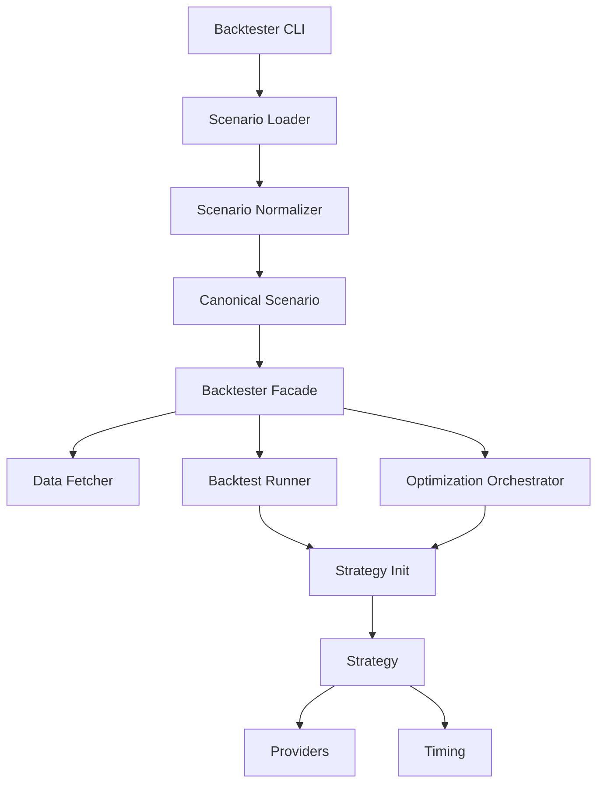
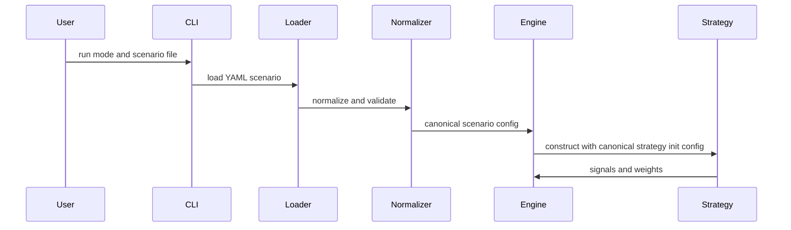
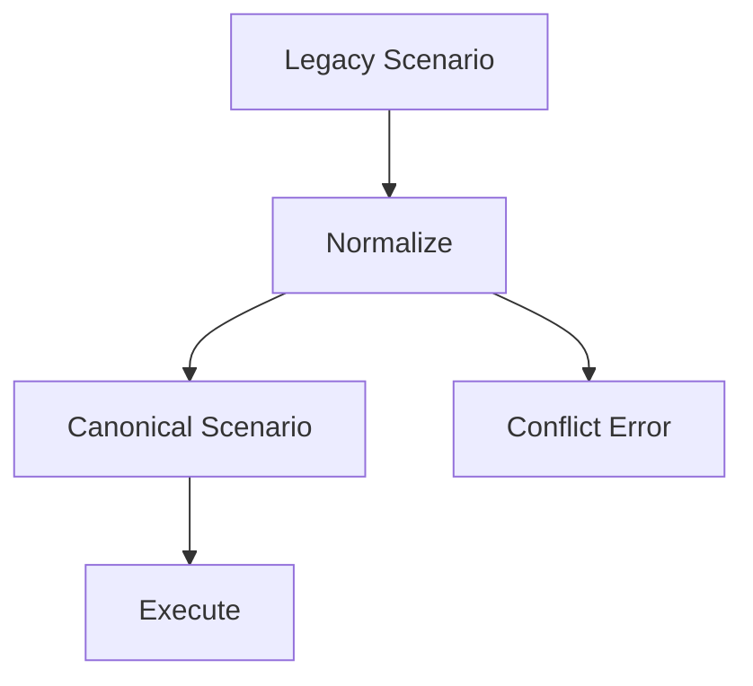

# Design Document

## Overview

This feature introduces a single, canonical scenario configuration contract that is applied consistently across Portfolio Backtester execution paths (backtest, optimize/WFO, evaluation, and reporting). It reduces configuration drift bugs by ensuring that scenario keys are normalized, validated, and consumed uniformly.

The core user value is reproducibility and predictability: a scenario file should have the same meaning regardless of which runtime path executes it. The design enforces an immutable canonical configuration and ensures strategies receive a complete configuration contract at construction time so timing and provider initialization are consistent.

### Goals

- Normalize each scenario to a canonical, immutable configuration before execution.
- Eliminate path-specific interpretation of universe and timing configuration.
- Ensure strategy initialization receives the same effective configuration in all runtime paths.
- Improve validation errors for conflicting or ambiguous configuration.
- Add regression tests that cover cross-path equivalence, including a dynamic-universe scenario.

### Non-Goals

- Rewrite the full backtesting engine into a single execution path.
- Remove all legacy scenario keys immediately (normalization can support a migration period).
- Change strategy logic or optimization algorithms beyond configuration interpretation.

## Architecture

### Existing Architecture Analysis

The codebase already performs YAML syntax validation and semantic validation. However, multiple runtime paths interpret scenario keys independently:

- Data prefetch and universe tickers are derived using ticker collectors in some paths.
- Strategies initialize timing controllers and providers in `__init__` from the config dict passed at instantiation time.
- Some paths attach `strategy.config` after construction, which cannot influence initialization-time behavior.

This creates drift risk where the same scenario behaves differently depending on which runtime path is used.

Assumption (explicit): the canonical contract will use a hybrid approach:

- a typed, canonical core schema used by all runtime code, and
- an immutable pass-through section for legacy/unknown keys during a migration period.

### Architecture Pattern & Boundary Map

Selected pattern: service-style canonicalization boundary.

- Domain/feature boundaries: separate scenario normalization (contract definition) from execution (backtest/optimization).
- Existing patterns preserved: facade orchestration, strategy registry/factory, provider interfaces, config-first workflow.
- New components rationale: a dedicated normalizer and canonical config types provide a single source of truth and are easily testable.
- Steering compliance: configuration belongs in YAML, strategies are auto-discovered, data fetching stays behind MDMP.



### Technology Stack

| Layer | Choice / Version | Role in Feature | Notes |
|-------|------------------|-----------------|-------|
| Frontend / CLI | argparse | Entry point triggers load and run | No change |
| Backend / Services | Python 3.10+ | Canonicalization and execution orchestration | Use standard library typing and dataclasses |
| Data / Storage | YAML + in-memory dicts | Scenario inputs and canonical config | No new storage |
| Infrastructure / Runtime | .venv + pytest + ruff/black/mypy | CI and developer workflows | No new dependencies |

## System Flows



Key decisions:

- Normalization runs before any strategy is constructed.
- Strategy initialization is based on canonical strategy init config, not post-init attachment.

## Requirements Traceability

| Requirement | Summary | Components | Interfaces | Flows |
|-------------|---------|------------|------------|-------|
| 1.1 | Normalize before execution | ScenarioNormalizer | ScenarioNormalizerService | System Flow |
| 1.2 | Deterministic output | ScenarioNormalizer | ScenarioNormalizerService | System Flow |
| 1.3 | Conflict detection | ScenarioNormalizer | ScenarioNormalizationErrors | System Flow |
| 1.4 | Apply defaults | ScenarioNormalizer | ScenarioNormalizerService | System Flow |
| 1.5 | Inspectable canonical config | CanonicalScenarioAccessor | CanonicalScenarioAccessorService | System Flow |
| 1.6 | Timing canonicalization | ScenarioNormalizer | ScenarioNormalizerService | System Flow |
| 1.7 | Timing conflicts error | ScenarioNormalizationErrors | ScenarioNormalizationErrors | System Flow |
| 1.8 | Universe conflicts error | ScenarioNormalizationErrors | ScenarioNormalizationErrors | System Flow |
| 1.9 | Canonical immutability | CanonicalScenarioConfig | CanonicalScenarioConfig | System Flow |
| 1.10 | Canonical schema covers consumed keys | ScenarioNormalizer | ScenarioNormalizerService | System Flow |
| 1.11 | Preserve unknown keys immutably | ScenarioNormalizer | ScenarioNormalizerService | System Flow |
| 2.1 | Semantics consistent across modes | BacktestRunner, OptimizationOrchestrator, StrategyBacktester | CanonicalScenarioAccessorService | System Flow |
| 2.2 | Universe consistent | UniverseResolutionAdapter | UniverseResolutionService | System Flow |
| 2.3 | Timing consistent | ScenarioNormalizer, StrategyInitConfigBuilder | StrategyInitConfigService | System Flow |
| 2.4 | Risk controls consistent | ScenarioNormalizer, StrategyInitConfigBuilder | StrategyInitConfigService | System Flow |
| 2.5 | Ticker collection from canonical config | DataFetcher | UniverseResolutionService | System Flow |
| 2.6 | No path-specific key interpretation | ScenarioNormalizer | CanonicalScenarioAccessorService | System Flow |
| 2.7 | No raw scenario dicts to runtime | ScenarioNormalizer, CanonicalScenarioAccessor | CanonicalScenarioAccessorService | System Flow |
| 3.1 | Single init contract | StrategyInitConfigBuilder | StrategyInitConfigService | System Flow |
| 3.2 | Timing available at init | StrategyInitConfigBuilder | StrategyInitConfigService | System Flow |
| 3.3 | Provider settings available at init | StrategyInitConfigBuilder | StrategyInitConfigService | System Flow |
| 3.4 | Preserve behavior where post-init attach existed | StrategyInitConfigBuilder | StrategyInitConfigService | System Flow |
| 3.5 | Same config in all instantiation paths | StrategyInitConfigBuilder | StrategyInitConfigService | System Flow |
| 3.6 | No dependency on post-init config attach | StrategyInitConfigBuilder | StrategyInitConfigService | System Flow |
| 3.7 | Providers/timing config present at init | StrategyInitConfigBuilder | StrategyInitConfigService | System Flow |
| 4.1 | Validation halts early | ScenarioNormalizer | ScenarioNormalizationErrors | System Flow |
| 4.2 | Unknown strategy error | ScenarioNormalizer | ScenarioNormalizationErrors | System Flow |
| 4.3 | Invalid optimize param error | ScenarioNormalizer | ScenarioNormalizationErrors | System Flow |
| 4.4 | Strategy-type-specific key errors | ScenarioNormalizer | ScenarioNormalizationErrors | System Flow |
| 4.5 | Conflict errors include keys and values | ScenarioNormalizationErrors | ScenarioNormalizationErrors | System Flow |
| 4.6 | Warn on normalizable legacy shapes | ScenarioNormalizer, ScenarioNormalizationErrors | ScenarioNormalizationErrors | System Flow |
| 5.1 | Legacy shapes normalize | ScenarioNormalizer | ScenarioNormalizerService | System Flow |
| 5.2 | Unsafe legacy shapes fail with action | ScenarioNormalizationErrors | ScenarioNormalizationErrors | System Flow |
| 5.3 | No silent meaning change | ScenarioNormalizer | ScenarioNormalizerService | System Flow |
| 5.4 | Strip strategy param prefixes | ScenarioNormalizer | ScenarioNormalizerService | System Flow |
| 5.5 | Flatten to canonical strategy_params when unambiguous | ScenarioNormalizer | ScenarioNormalizerService | System Flow |
| 6.1 | Tests for normalization | ScenarioNormalizationTests | n/a | n/a |
| 6.2 | Tests for cross-path equivalence | CrossPathEquivalenceTests | n/a | n/a |
| 6.3 | Tests/docs updated with rule changes | ScenarioNormalizationTests, CrossPathEquivalenceTests | n/a | n/a |
| 6.4 | Dynamic universe regression | CrossPathEquivalenceTests | n/a | n/a |
| 6.5 | Strategy init equivalence regression | CrossPathEquivalenceTests | n/a | n/a |

## Components and Interfaces

Component summary:

| Component | Domain/Layer | Intent | Req Coverage | Key Dependencies (P0/P1) | Contracts |
|-----------|--------------|--------|--------------|--------------------------|-----------|
| ScenarioNormalizer | Config | Produce canonical scenario config from inputs | 1.1-1.11, 2.7, 4.6, 5.1-5.5 | ScenarioValidator (P0), GlobalConfig (P0) | Service |
| StrategyInitConfigBuilder | Config/Strategies | Build canonical strategy init config | 3.1-3.7 | CanonicalScenarioConfig (P0) | Service |
| CanonicalScenarioAccessor | Runtime | Provide canonical config to runtime components | 1.5, 2.1-2.7 | CanonicalScenarioConfig (P0) | Service |
| UniverseResolutionAdapter | Runtime | Ensure universe resolution uses canonical config | 2.2, 2.5 | DataFetcher, Providers (P0) | Service |
| ScenarioNormalizationErrors | Config | Standardize conflict and migration errors | 1.3, 1.7-1.8, 4.5, 5.2 | ConfigurationError (P0) | Service |
| ScenarioNormalizationTests | Tests | Verify normalization mapping and conflicts | 6.1 | pytest (P0) | n/a |
| CrossPathEquivalenceTests | Tests | Verify equivalence across runtime paths | 6.2, 6.4, 6.5 | pytest (P0) | n/a |

### Integration Plan (Concrete Call Sites)

This design is implemented by routing all scenario execution paths through a single normalization boundary and using the same strategy init contract in both instantiation paths.

Integration points to update:

- Scenario loading:
  - `src/portfolio_backtester/config_loader.py` (scenario load and merge of optimizer defaults)
- Orchestration entry:
  - `src/portfolio_backtester/backtester_logic/backtester_facade.py` (ensure normalized scenarios are used throughout run)
- Strategy instantiation path A (facade/backtest mode):
  - `src/portfolio_backtester/backtester_logic/strategy_manager.py`
  - `src/portfolio_backtester/strategies/_core/strategy_factory_impl.py`
- Strategy instantiation path B (evaluation/optimization):
  - `src/portfolio_backtester/backtesting/strategy_backtester.py`
- Data prefetch and universe ticker collection:
  - `src/portfolio_backtester/backtester_logic/data_fetcher.py`

Enforcement rule:

- After normalization, runtime components must not consume raw, unnormalized `scenario_config` dictionaries.

### Config Layer

#### ScenarioNormalizer

| Field | Detail |
|-------|--------|
| Intent | Normalize and validate scenario input into a canonical configuration |
| Requirements | 1.1, 1.2, 1.3, 1.4, 1.6, 1.7, 1.8, 1.9, 5.1, 5.2, 5.3, 5.4, 5.5 |

**Responsibilities & Constraints**

- Produce a canonical scenario config used as the single source of truth for the run.
- Apply conflict detection for equivalent or competing keys (timing and universe definitions).
- Apply defaults from global config and strategy defaults, without silently changing meaning.
- Ensure canonical config is immutable for the duration of execution.

**Dependencies**

- Inbound: Scenario Loader - provides raw scenario dict (P0)
- Outbound: Scenario Validator - validates strategy existence and tunables (P0)
- Outbound: Strategy Registry - resolves strategy type for meta constraints (P0)

**Contracts**: Service [x] / API [ ] / Event [ ] / Batch [ ] / State [x]

##### Service Interface

```python
from __future__ import annotations

from dataclasses import dataclass
from typing import Any, Mapping, Optional


@dataclass(frozen=True)
class CanonicalScenarioConfig:
    name: str
    strategy: str
    start_date: Optional[str]
    end_date: Optional[str]
    benchmark_ticker: Optional[str]
    timing_config: Mapping[str, Any]
    universe_definition: Mapping[str, Any]
    position_sizer: Optional[str]
    optimization_metric: Optional[str]
    wfo_config: Mapping[str, Any]
    optimizer_config: Mapping[str, Any]
    strategy_params: Mapping[str, Any]
    optimize: Optional[list[Mapping[str, Any]]]
    extras: Mapping[str, Any]


class ScenarioNormalizerService:
    def normalize(
        self,
        *,
        scenario: Mapping[str, Any],
        global_config: Mapping[str, Any],
        source: Optional[str] = None,
    ) -> CanonicalScenarioConfig: ...
```

- Preconditions:
  - `scenario` is a mapping.
  - YAML syntax validation already passed.
- Postconditions:
  - Output config is canonical and immutable.
  - Conflicts produce a validation error before execution begins.
- Invariants:
  - Canonical config is the only source of truth for downstream components.

**Canonical Schema Mapping (Key Normalization Rules)**

The canonical schema explicitly covers keys consumed across runtime paths. The mapping below is the authoritative interpretation contract.

| Input Key(s) | Canonical Location | Conflict Rule | Default Source |
|-------------|--------------------|--------------|----------------|
| `name` | `name` | required | none |
| `strategy` | `strategy` | required | none |
| `strategy_params` | `strategy_params` | required (may be empty) | strategy defaults may fill missing keys |
| `<strategy>.param` in `strategy_params` | `strategy_params` | prefix stripped; conflicts error | none |
| flat legacy params (not under `strategy_params`) | `strategy_params` | normalize only if unambiguous; else error | none |
| `timing_config` | `timing_config` | merged with `rebalance_frequency` rule below | strategy defaults + global defaults |
| `rebalance_frequency` and `timing_config.rebalance_frequency` | `timing_config.rebalance_frequency` | if both set and differ, error | global/strategy default if neither set |
| `universe_config` | `universe_definition` | conflicts with `universe` | none |
| `universe` | `universe_definition` | conflicts with `universe_config` | none |
| `position_sizer` | `position_sizer` | direct | global defaults |
| `benchmark_ticker` and global benchmark | `benchmark_ticker` | scenario value overrides global benchmark | global config |
| `start_date`, `end_date` | `start_date`, `end_date` | scenario values override global values | global config |
| WFO keys (`train_window_months`, `test_window_months`, `walk_forward_type`, `wfo_step_months`, `walk_forward_step_months`, `wfo_mode`) | `wfo_config` | conflicts resolved per explicit key precedence | global defaults |
| `optimization_metric` | `optimization_metric` | direct | global defaults |
| `optimize` | `optimize` | direct; invalid entries error | global optimizer defaults |
| `optimizers` (mapping) | `optimizer_config` | if multiple optimizers: select `optuna` if present else first key; warn with selected and ignored; invalid structure error | global optimizer defaults |
| `optimizers` plus flattened optimizer keys | `optimizer_config` | flattened keys are derived from selected optimizer config and must not conflict with explicitly set top-level keys without warning | global optimizer defaults |
| unknown keys | `extras` | preserved as immutable pass-through | none |

The canonicalization layer must fail fast on conflicts rather than silently choosing precedence.

#### StrategyInitConfigBuilder

| Field | Detail |
|-------|--------|
| Intent | Produce the strategy constructor input contract from canonical scenario config |
| Requirements | 3.1, 3.2, 3.3, 3.4, 3.5, 3.6 |

**Responsibilities & Constraints**

- Ensure timing and provider-relevant config is available at strategy construction time.
- Ensure legacy patterns that relied on post-init attachment keep correct behavior.
- Ensure consistent contract across strategy instantiation paths.

**Dependencies**

- Inbound: BacktestRunner and StrategyBacktester request strategy instances (P0)
- Outbound: StrategyFactory or registry-based instantiation (P0)

**Contracts**: Service [x] / API [ ] / Event [ ] / Batch [ ] / State [ ]

##### Service Interface

```python
from typing import Any, Dict, Mapping


class StrategyInitConfigService:
    def build_strategy_init_config(
        self,
        *,
        canonical_scenario: CanonicalScenarioConfig,
        global_config: Mapping[str, Any],
    ) -> Dict[str, Any]: ...
```

- Preconditions:
  - `canonical_scenario` is already normalized.
- Postconditions:
  - Returned dict can be passed directly to strategy constructors.
  - Timing and provider settings are present in the init config.

### Runtime Layer

#### CanonicalScenarioAccessor

| Field | Detail |
|-------|--------|
| Intent | Provide canonical config to runtime components without mutation |
| Requirements | 1.5, 2.1, 2.6 |

**Responsibilities & Constraints**

- Expose canonical scenario config for debugging and testing.
- Avoid downstream mutation by returning immutable objects or defensive copies.

**Dependencies**

- Inbound: Backtester facade and pipeline components (P0)
- Outbound: None (P2)

**Contracts**: Service [x] / API [ ] / Event [ ] / Batch [ ] / State [x]

##### Service Interface

```python
from typing import Optional


class CanonicalScenarioAccessorService:
    def get_canonical_scenario(self, *, scenario_name: str) -> Optional[CanonicalScenarioConfig]: ...
```

#### UniverseResolutionAdapter

| Field | Detail |
|-------|--------|
| Intent | Ensure universe resolution and ticker collection are derived from canonical config |
| Requirements | 2.2, 2.5 |

**Responsibilities & Constraints**

- Ensure DataFetcher and all execution paths use the same universe definition.
- Prevent runtime mutation of scenario dicts to inject universe after strategy instantiation.
- Bridge existing universe selection mechanisms (ticker collectors and universe providers) so they read from the canonical universe definition.

**Dependencies**

- Inbound: DataFetcher, StrategyBacktester, BacktestRunner (P0)
- Outbound: Ticker collectors and universe providers (P0)

**Contracts**: Service [x] / API [ ] / Event [ ] / Batch [ ] / State [ ]

##### Service Interface

```python
from typing import Any, Mapping, Sequence


class UniverseResolutionService:
    def collect_required_tickers(
        self,
        *,
        canonical_scenario: CanonicalScenarioConfig,
        global_config: Mapping[str, Any],
    ) -> Sequence[str]: ...
```

## Data Models

### Domain Model

Canonical scenario configuration is treated as a value object:

- It is created once (normalization) and then treated as immutable.
- It contains the complete set of inputs needed to interpret a scenario deterministically.

### Logical Data Model

Canonical scenario configuration groups conceptually related configuration into explicit sections:

- Strategy identity and params
- Timing configuration
- Universe definition
- Optimization configuration

The canonical config may be represented as a frozen dataclass or an immutable mapping. The chosen representation must prevent accidental mutation and must be inspectable for debugging.

## Error Handling

### Error Strategy

- Fail fast before execution begins if configuration is ambiguous, conflicting, or unsupported.
- Preserve actionable error messages, including conflicting keys and values.

### Error Categories and Responses

- User errors: scenario conflicts, unknown strategy, invalid parameter definitions.
- System errors: unexpected failures during normalization should surface as a configuration load failure and stop execution.

### Monitoring

- Log normalization output and conflict detection at DEBUG.
- Log warnings for deprecated shapes that normalize successfully.

## Testing Strategy

- Unit Tests:
  - normalization mapping rules (timing key canonicalization, strategy param prefix stripping)
  - conflict detection (timing conflicts, universe conflicts)
  - immutability expectations (canonical config not mutated)
- Integration Tests:
  - execute a representative scenario through backtest mode and through the evaluation path used in optimization and compare effective configuration and key outputs.
  - ensure ticker collection uses the same universe definition across paths.
- Regression Tests:
  - include at least one dynamic-universe scenario and verify consistent normalization and execution semantics.
  - include at least one test that instantiates the same strategy via both major runtime paths and compares effective strategy init config.

## Migration Strategy

Migration is staged to preserve existing scenario files while making meaning changes explicit:



- Deprecated but normalizable patterns produce warnings.
- Unsupported or ambiguous patterns fail with an actionable migration message.
