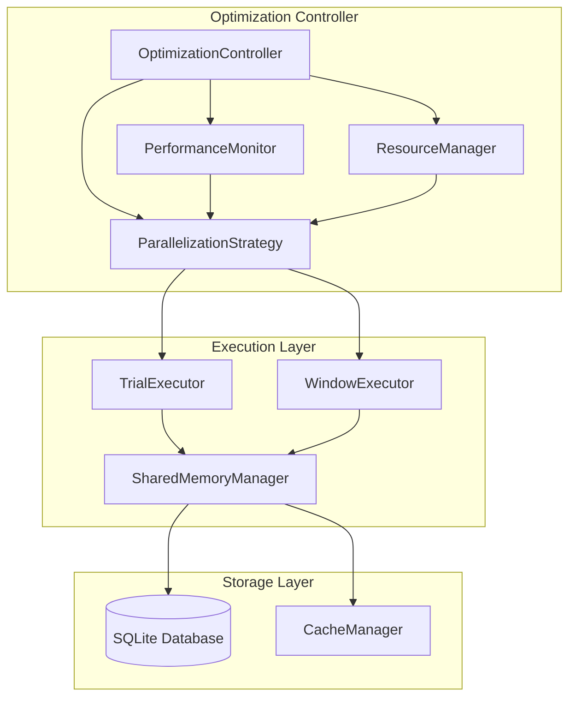

# Design Document

## Overview

The current portfolio backtester optimization system suffers from inefficient nested parallelization where process-level parallelization for trials conflicts with window-level parallelization within each trial. The genetic optimizer uses multiprocessing.Pool for trial-level parallelization, while the BacktestEvaluator has window-level parallelization capabilities that are often disabled to avoid conflicts.

This design proposes a hybrid parallelization architecture that intelligently balances trial-level and window-level parallelization based on workload characteristics, available resources, and performance profiling data.

## Architecture

### Current Architecture Issues

1. **Nested Parallelization Conflict**: Genetic optimizer creates process pools for trials, while BacktestEvaluator can create additional processes for windows, leading to oversubscription
2. **Resource Contention**: Multiple levels of parallelization compete for CPU cores and memory
3. **Memory Duplication**: Each process loads full datasets independently
4. **Fixed Strategy**: No dynamic adaptation based on workload or hardware characteristics

### Proposed Architecture



### Core Components

#### 1. OptimizationController
Central orchestrator that manages the entire optimization process and coordinates between different parallelization strategies.

**Responsibilities:**
- Initialize and configure parallelization strategy
- Monitor system resources and performance
- Handle optimization lifecycle (start, pause, resume, stop)
- Coordinate between trial and window execution

#### 2. ParallelizationStrategy
Intelligent strategy selector that determines optimal parallelization approach based on workload characteristics and system resources.

**Strategy Types:**
- **TrialParallel**: High trial parallelization, sequential window processing
- **WindowParallel**: Sequential trial processing, high window parallelization  
- **Hybrid**: Balanced approach with moderate trial and window parallelization
- **Adaptive**: Dynamic switching based on runtime performance metrics

#### 3. ResourceManager
Monitors and manages system resources to prevent oversubscription and optimize performance.

**Capabilities:**
- CPU core allocation and monitoring
- Memory usage tracking and limits
- Dynamic resource reallocation
- Graceful degradation under resource pressure

#### 4. SharedMemoryManager
Manages shared data structures to minimize memory duplication across processes.

**Features:**
- Shared dataset storage using multiprocessing.shared_memory
- Copy-on-write semantics for parameter variations
- Efficient serialization for inter-process communication
- Memory pool management and cleanup

#### 5. PerformanceMonitor
Collects detailed performance metrics and provides optimization recommendations.

**Metrics Tracked:**
- CPU utilization per parallelization level
- Memory usage patterns
- I/O wait times
- Database contention metrics
- Trial/window completion rates

## Components and Interfaces

### ParallelizationStrategy Interface

```python
class ParallelizationStrategy(ABC):
    @abstractmethod
    def determine_parallelization(
        self, 
        num_trials: int, 
        num_windows: int, 
        available_cores: int,
        memory_limit: int
    ) -> ParallelizationConfig:
        """Determine optimal parallelization configuration."""
        pass
    
    @abstractmethod
    def should_rebalance(self, performance_metrics: Dict[str, float]) -> bool:
        """Determine if parallelization should be rebalanced."""
        pass
```

### ResourceManager Interface

```python
class ResourceManager:
    def allocate_cores(self, trial_cores: int, window_cores: int) -> bool:
        """Allocate CPU cores for trial and window processing."""
        pass
    
    def check_memory_pressure(self) -> MemoryStatus:
        """Check current memory usage and pressure."""
        pass
    
    def enforce_limits(self) -> None:
        """Enforce resource limits and trigger cleanup if needed."""
        pass
```

### SharedMemoryManager Interface

```python
class SharedMemoryManager:
    def create_shared_dataset(self, data: OptimizationData) -> SharedDatasetHandle:
        """Create shared memory representation of dataset."""
        pass
    
    def get_dataset_view(self, handle: SharedDatasetHandle) -> OptimizationData:
        """Get read-only view of shared dataset."""
        pass
    
    def cleanup_shared_resources(self) -> None:
        """Clean up shared memory resources."""
        pass
```

## Data Models

### ParallelizationConfig

```python
@dataclass
class ParallelizationConfig:
    strategy_type: str  # 'trial_parallel', 'window_parallel', 'hybrid', 'adaptive'
    trial_processes: int
    window_processes: int
    max_memory_per_process: int
    enable_shared_memory: bool
    database_connection_pool_size: int
```

### PerformanceMetrics

```python
@dataclass
class PerformanceMetrics:
    cpu_utilization: float
    memory_usage: float
    trials_per_second: float
    windows_per_second: float
    database_contention_ratio: float
    memory_pressure_events: int
    timestamp: datetime
```

### ResourceStatus

```python
@dataclass
class ResourceStatus:
    available_cores: int
    total_memory: int
    available_memory: int
    memory_pressure: bool
    cpu_load_average: float
```

## Error Handling

### Resource Exhaustion
- **Detection**: Monitor memory usage and CPU load continuously
- **Response**: Gracefully reduce parallelization levels
- **Recovery**: Gradually increase parallelization as resources become available

### Process Failures
- **Detection**: Monitor process health and completion status
- **Response**: Restart failed processes and redistribute work
- **Recovery**: Implement exponential backoff for repeatedly failing tasks

### Database Contention
- **Detection**: Monitor SQLite lock timeouts and retry counts
- **Response**: Implement connection pooling and retry mechanisms
- **Recovery**: Temporarily reduce concurrent database operations

### Memory Pressure
- **Detection**: Monitor system memory usage and swap activity
- **Response**: Trigger garbage collection and reduce shared memory usage
- **Recovery**: Implement memory-efficient data structures and cleanup routines

## Testing Strategy

### Unit Tests
- **ParallelizationStrategy**: Test strategy selection logic with various workload scenarios
- **ResourceManager**: Test resource allocation and limit enforcement
- **SharedMemoryManager**: Test shared memory creation, access, and cleanup
- **PerformanceMonitor**: Test metrics collection and analysis

### Integration Tests
- **End-to-End Optimization**: Test complete optimization runs with different parallelization strategies
- **Resource Pressure**: Test behavior under memory and CPU constraints
- **Database Concurrency**: Test SQLite operations under high concurrency
- **Failure Recovery**: Test recovery from various failure scenarios

### Performance Tests
- **Scalability**: Test performance scaling with different core counts and dataset sizes
- **Memory Efficiency**: Measure memory usage patterns and shared memory effectiveness
- **Throughput**: Compare trials/second and windows/second across strategies
- **Latency**: Measure optimization completion times for various scenarios

### Benchmark Tests
- **Before/After Comparison**: Compare performance against current implementation
- **Strategy Comparison**: Compare different parallelization strategies
- **Hardware Scaling**: Test performance across different hardware configurations
- **Dataset Size Impact**: Test performance with various dataset sizes

## Implementation Phases

### Phase 1: Core Infrastructure
- Implement OptimizationController and basic strategy selection
- Create ResourceManager with basic resource monitoring
- Implement SharedMemoryManager with simple shared dataset support
- Add PerformanceMonitor with basic metrics collection

### Phase 2: Strategy Implementation
- Implement TrialParallel and WindowParallel strategies
- Add Hybrid strategy with balanced parallelization
- Integrate with existing genetic optimizer and Optuna adapter
- Add basic error handling and recovery mechanisms

### Phase 3: Advanced Features
- Implement Adaptive strategy with dynamic rebalancing
- Add advanced shared memory optimizations
- Implement comprehensive error handling and recovery
- Add detailed performance profiling and recommendations

### Phase 4: Optimization and Tuning
- Performance optimization based on benchmark results
- Memory usage optimization and leak prevention
- Database connection pooling and optimization
- Advanced monitoring and alerting capabilities