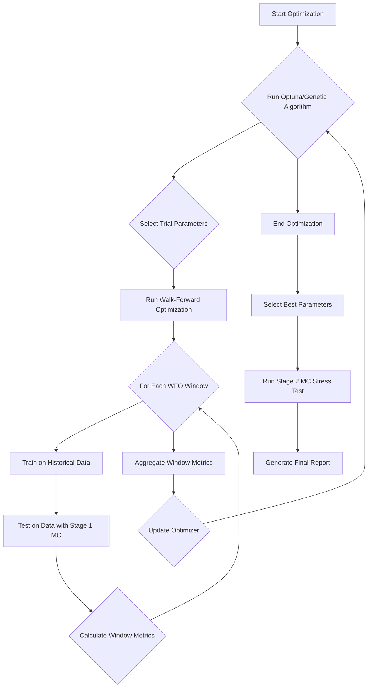
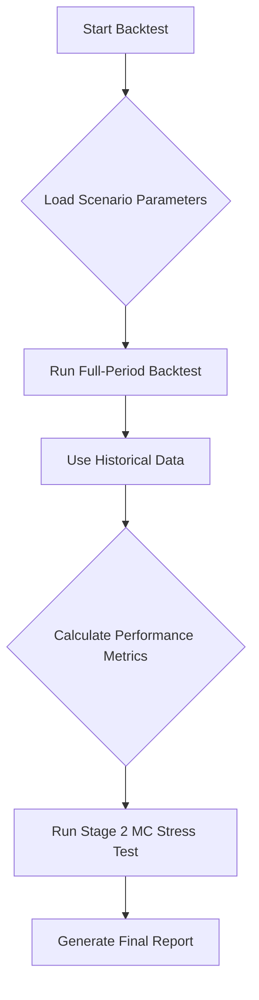
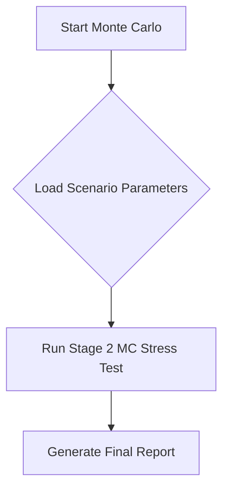

# Portfolio Backtester

This project is a sophisticated Python-based tool for backtesting portfolio strategies with advanced features including two-stage Monte Carlo simulation, walk-forward optimization robustness testing, and comprehensive performance analysis.

## Key Features

### Core Capabilities
- **Multiple Strategy Types**: 11 fully verified strategies including Momentum, VAMS, Calmar, Sortino, EMA Crossover, and Low Volatility Factor
- **Advanced Position Sizing**: Equal weight, volatility-based, risk-adjusted sizing
- **Flexible Rebalancing**: Monthly, quarterly, custom frequencies
- **Transaction Cost Modeling**: Realistic cost simulation with basis points
- **Production-Ready**: All strategies verified post-refactoring with comprehensive testing

### Advanced Optimization
- **Walk-Forward Optimization (WFO)**: Robust parameter optimization with time-series validation
- **WFO Robustness Features**: Randomized window sizes and start dates for enhanced robustness
- **Multi-Objective Optimization**: Simultaneous optimization of multiple metrics (Sharpe, Sortino, Max Drawdown)
- **Dual Optimization Engines**: Optuna (Bayesian) and Genetic Algorithm support
- **Advanced Genetic Algorithm Features**: Adaptive parameter control, elite preservation, and sophisticated crossover operators
- **Trial Pruning**: Early stopping of unpromising parameter combinations

### Two-Stage Monte Carlo System
- **Stage 1 (During Optimization)**: Lightweight synthetic data injection for parameter robustness testing
- **Stage 2 (Post-Optimization)**: Comprehensive stress testing with multiple replacement levels
- **GARCH-Based Synthetic Data**: Realistic market condition simulation preserving statistical properties
- **Asset Replacement Strategy**: Configurable percentage of assets replaced with synthetic equivalents

### Advanced Analytics & Reporting
- **Comprehensive Performance Metrics**: Sharpe, Sortino, Calmar ratios, drawdown analysis
- **Stability Metrics**: Parameter consistency across walk-forward windows
- **Trial P&L Visualization**: Monte Carlo-style plots showing optimization trial performance
- **Parameter Impact Analysis**: Sensitivity, correlation, and importance ranking (configurable)
- **Robustness Stress Testing**: Visual analysis of strategy performance under synthetic market conditions
- **Configurable Reporting**: Advanced hyperparameter analysis can be disabled for faster optimization

### Enhanced Configuration System
- **YAML-Based Configuration**: Flexible parameter and scenario management
- **Configurable Universes**: Three flexible ways to define trading universes (fixed, named, method-based)
- **Robustness Configuration**: Fine-tuned control over WFO randomization
- **Monte Carlo Configuration**: Detailed control over synthetic data generation
- **Advanced Reporting Configuration**: Control over statistical analysis generation for faster optimization
- **Strategy Parameter Defaults**: Centralized optimization parameter management

### Fail-Tolerance Data Gathering
- **Hybrid Data Source**: Automatic failover between Stooq and yfinance data sources
- **Data Validation**: Comprehensive validation of downloaded data quality
- **Format Normalization**: Consistent MultiIndex output regardless of source
- **Failure Tracking**: Detailed reporting of data source failures and successes
- **Configurable Preferences**: Choose primary data source (Stooq or yfinance)

## Execution Flow

The following diagrams illustrate the execution flow of the backtester in its different modes.

### Optimization Mode (`--mode optimize`)



### Backtest Mode (`--mode backtest`)



### Monte Carlo Mode (`--mode monte_carlo`)



## Setup

1. **Create a virtual environment:**

    ```bash
    python -m venv .venv
    ```

2. **Activate the virtual environment:**
    * **Windows:**

        ```bash
        .venv\Scripts\activate
        ```

    * **macOS/Linux:**

        ```bash
        source .venv/bin/activate
        ```

3. **Install dependencies:**

    ```bash
    pip install -e .
    ```

## Usage

The main backtesting script can be run directly as a Python module:

```bash
python -m src.portfolio_backtester.backtester
```

### CLI Parameters

#### Core Parameters
* `--mode`: Mode to run the backtester in.
  * **Choices:** `backtest`, `optimize`, `monte_carlo`
  * **Required:** Yes
  * **Description:** 
    - `backtest`: Single scenario backtesting
    - `optimize`: Walk-forward optimization with robustness features
    - `monte_carlo`: Full Monte Carlo stress testing analysis
* `--scenario-name`: Name of the scenario from `config/scenarios.yaml`
  * **Required:** Yes for optimize/monte_carlo modes
* `--log-level`: Set the logging level
  * **Choices:** `DEBUG`, `INFO`, `WARNING`, `ERROR`, `CRITICAL`
  * **Default:** `INFO`

#### S&P 500 Universe Data Management
For instructions on how to manage and update the S&P 500 historical constituent data, please refer to the [S&P 500 Universe Data Management Guide](docs/sp500_universe_management.md).
All related scripts are located in `src/portfolio_backtester/universe_data/`.

#### Optimization Parameters
* `--optimizer`: Choose the optimization algorithm
  * **Choices:** `optuna`, `genetic`
  * **Default:** `optuna`
* `--optuna-trials`: Maximum trials per optimization
  * **Default:** `200`
* `--timeout`: Time budget per optimization (seconds)
  * **Default:** `None` (no timeout)
* `--n-jobs`: Parallel worker processes
  * **Default:** `8` (`-1` means all cores)
* `--random-seed`: Set random seed for reproducibility
  * **Default:** `None`

#### Advanced Optimization Features
* `--pruning-enabled`: Enable trial pruning for faster optimization
* `--pruning-n-startup-trials`: Trials to complete before pruning begins
  * **Default:** `5`
* `--pruning-interval-steps`: Report interval for pruning checks
  * **Default:** `1`
* `--early-stop-patience`: Stop after N consecutive poor trials
  * **Default:** `10`

#### Monte Carlo Parameters
* `--mc-simulations`: Number of Monte Carlo simulations
  * **Default:** `1000`
* `--mc-years`: Years to project in Monte Carlo analysis
  * **Default:** `10`
* `--interactive`: Show plots interactively

### Examples

**1. Basic Strategy Backtest:**
```bash
python -m src.portfolio_backtester.backtester --mode backtest --scenario-name "Momentum_Unfiltered"
```

**2. Advanced Optimization with Robustness:**
```bash
python -m src.portfolio_backtester.backtester \
  --mode optimize \
  --scenario-name "Momentum_Unfiltered" \
  --study-name "robust_momentum_v1" \
  --optimizer optuna \
  --optuna-trials 500 \
  --pruning-enabled \
  --n-jobs -1 \
  --random-seed 42
```

**3. Monte Carlo Stress Testing:**
```bash
python -m src.portfolio_backtester.backtester \
  --mode monte_carlo \
  --scenario-name "Momentum_Unfiltered" \
  --mc-simulations 2000 \
  --mc-years 15 \
  --interactive
```

**4. Genetic Algorithm Optimization:**
```bash
python -m src.portfolio_backtester.backtester \
  --mode optimize \
  --scenario-name "VAMS_Momentum" \
  --optimizer genetic \
  --optuna-trials 200 \
  --study-name "genetic_vams_opt"
```

## Configuration Files

The backtester uses a set of YAML files in the `config/` directory to manage global settings, define specific backtest experiments, and provide examples.

## Universe Configuration

The backtester supports flexible universe configuration through three different approaches:

### 1. Fixed Universe
Define a static list of tickers directly in the strategy configuration:

```yaml
universe_config:
  type: "fixed"
  tickers: 
    - "AAPL"
    - "MSFT"
    - "GOOGL"
    - "AMZN"
    - "NVDA"
```

### 2. Named Universe
Reference predefined universe files stored in `config/universes/`:

```yaml
universe_config:
  type: "named"
  universe_name: "sp500_top50"
```

Universe files use a simple text format with one ticker per line:
```
# S&P 500 Top 50 companies
AAPL
MSFT
GOOGL  # Alphabet Class A
AMZN
# Comments and empty lines are supported
NVDA
```

### 3. Multiple Named Universes
Combine multiple named universes (union of all tickers):

```yaml
universe_config:
  type: "named"
  universe_names: 
    - "nasdaq_top20"
    - "dow_jones"
```

### 4. Method-Based Universe
Use dynamic universe generation methods:

```yaml
universe_config:
  type: "method"
  method_name: "get_top_weight_sp500_components"
  n_holdings: 50
  exact: false
```

### Built-in Named Universes

The following named universes are included:

- **sp500_top50**: Top 50 S&P 500 companies by market capitalization
- **nasdaq_top20**: Top 20 NASDAQ companies by market capitalization  
- **dow_jones**: All 30 Dow Jones Industrial Average components

### Backward Compatibility

Existing configurations continue to work without changes:
- Strategies without `universe_config` use the global universe
- Scenario-level `universe` overrides still take precedence
- Custom `get_universe()` method overrides are preserved

### 1. `parameters.yaml` (Global Settings)

This file establishes the foundational parameters for the entire backtesting environment. It contains the default settings that are inherited by all scenarios unless explicitly overridden.

- **Purpose**: To define the global environment, default optimizer search ranges, and system-wide feature configurations.
- **Key Sections**:
  - `GLOBAL_CONFIG`: Sets the default stock `universe`, `benchmark`, date ranges, and transaction cost models.
  - `OPTIMIZER_PARAMETER_DEFAULTS`: Defines the default search space (min, max, step) for every optimizable parameter (e.g., `leverage`, `lookback_months`).
  - `wfo_robustness_config`, `monte_carlo_config`, etc.: Configure advanced features like Walk-Forward Optimization and Monte Carlo simulations.

### 2. `scenarios.yaml` (Backtest Experiments)

This is the primary file for defining and managing your specific backtesting experiments. Each entry in this file represents a complete, runnable test.

- **Purpose**: To define specific combinations of strategies, parameters, and optimization goals.
- **Example Scenario**:

  ```yaml
  - name: "Momentum_Simple_Test"
    strategy: "momentum"
    rebalance_frequency: "ME"
    position_sizer: "equal_weight"
    transaction_costs_bps: 10
    train_window_months: 36
    test_window_months: 12
    optimization_targets:
      - name: "Sortino"
        direction: "maximize"
    optimize:
      - parameter: "num_holdings"
        min_value: 10
        max_value: 25
        step: 5
    strategy_params:
      lookback_months: 12
      long_only: True
  ```

### 3. `timing_examples.yaml` (How-To Guide for Timing)

This file is a supplementary resource dedicated to showcasing the capabilities of the flexible timing framework. It is not used directly by the backtester but serves as a valuable source of examples.

- **Purpose**: To provide clear, ready-to-use examples for different timing configurations (time-based, signal-based, and custom controllers).
- **Usage**: Copy and paste configurations from this file into your `scenarios.yaml` to implement advanced timing strategies.

## Detailed Configuration Sections

### WFO Robustness Configuration (`config/parameters.yaml`)

```yaml
wfo_robustness_config:
  enable_window_randomization: true
  enable_start_date_randomization: true
  train_window_randomization:
    min_offset: 3    # Minimum months to add to base train window
    max_offset: 14   # Maximum months to add to base train window
  test_window_randomization:
    min_offset: 3    # Minimum months to add to base test window
    max_offset: 14   # Maximum months to add to base test window
  start_date_randomization:
    min_offset: 0    # Minimum months to offset start date
    max_offset: 12   # Maximum months to offset start date
  stability_metrics:
    enable: true
    worst_percentile: 10
    consistency_threshold: 0.0
  random_seed: null  # Set for reproducible randomization
```

### Monte Carlo Configuration

```yaml
monte_carlo_config:
  enable_synthetic_data: true
  enable_during_optimization: true    # Stage 1: Lightweight MC during optimization
  enable_stage2_stress_testing: true  # Stage 2: Full stress testing after optimization
  replacement_percentage: 0.05        # 5% of assets replaced with synthetic data
  min_historical_observations: 200    # Minimum data for parameter estimation
  
  garch_config:
```

### Data Source Configuration

The system supports multiple data sources with automatic failover:

```yaml
GLOBAL_CONFIG:
  data_source: "hybrid"        # Options: "hybrid", "stooq", "yfinance"
  prefer_stooq: true          # For hybrid mode: use Stooq as primary source
```

#### Data Source Options:
- **`hybrid`** (Recommended): Uses Stooq as primary source with yfinance fallback
- **`stooq`**: Uses only Stooq data source
- **`yfinance`**: Uses only yfinance data source

The hybrid data source provides:
- Automatic failover when primary source fails
- Comprehensive data validation and quality checks
- Consistent MultiIndex format regardless of source
- Detailed failure reporting and statistics
- Configurable cache expiration (default: 24 hours)
    model_type: "GARCH"
    p: 1
    q: 1
    distribution: "studentt"
    bounds:
      omega: [1e-6, 1.0]
      alpha: [0.01, 0.3]
      beta: [0.5, 0.99]
      nu: [2.1, 30.0]
  
  generation_config:
    buffer_multiplier: 1.2
    max_attempts: 2
    validation_tolerance: 0.3
  
  validation_config:
    enable_validation: false  # Disabled during optimization for speed
    tolerance: 0.8
```

### Advanced Reporting Configuration

```yaml
advanced_reporting_config:
  # Enable/disable advanced hyperparameter statistical analysis
  enable_advanced_parameter_analysis: false  # Disabled by default for faster optimization
  
  # Enable/disable regular performance metrics calculation
  enable_performance_metrics: true  # Always enabled for basic reporting
  
  # Enable/disable comprehensive optimization reports
  enable_optimization_reports: true  # Enabled by default for organized report directories
```

**Advanced Parameter Analysis includes:**
- Parameter correlation matrices
- Parameter sensitivity analysis  
- Parameter importance ranking
- Parameter stability analysis
- Parameter robustness assessment
- Parameter performance heatmaps

**When disabled (default):**
- ✅ **Faster optimization** - No complex statistical plots generated
- ✅ **Cleaner reports** - Focus on essential performance metrics
- ✅ **Regular performance metrics** - Sharpe, Calmar, drawdown analysis still included
- ✅ **Basic visualizations** - Performance plots and trial analysis still generated

## Performance Metrics

The backtester calculates comprehensive performance metrics:

| Metric | Description | Interpretation |
|--------|-------------|----------------|
| **Total Return** | Cumulative return over period | Higher is better |
| **Annualized Return** | Geometric mean annual return | Higher is better |
| **Volatility** | Annualized standard deviation | Lower is generally better |
| **Sharpe Ratio** | Risk-adjusted return (excess return / volatility) | Higher is better |
| **Sortino Ratio** | Downside risk-adjusted return | Higher is better |
| **Calmar Ratio** | Return / Maximum Drawdown | Higher is better |
| **Max Drawdown** | Largest peak-to-trough decline | Lower is better |
| **VaR (95%)** | Value at Risk at 95% confidence | Lower absolute value is better |
| **CVaR (95%)** | Conditional Value at Risk | Lower absolute value is better |

### Stability Metrics (WFO Robustness)

| Metric | Description | Interpretation |
|--------|-------------|----------------|
| **Metric_Std** | Standard deviation across WFO windows | Lower indicates more stable performance |
| **Metric_CV** | Coefficient of variation (Std/Mean) | Lower indicates more consistent performance |
| **Metric_Worst_Xpct** | Worst percentile performance | Higher worst-case is better |
| **Metric_Consistency_Ratio** | Fraction of windows above threshold | Higher indicates more reliable performance |

## Architecture

### Two-Stage Monte Carlo System

The backtester implements a sophisticated two-stage Monte Carlo system for comprehensive strategy validation:

**Stage 1: Parameter Robustness Testing (During Optimization)**
- Lightweight synthetic data injection during walk-forward optimization
- Single replacement percentage (typically 5-10% of universe)
- Tests parameter stability against slightly modified market conditions
- Prevents overfitting to specific market regimes

**Stage 2: Strategy Stress Testing (Post-Optimization)**
- Comprehensive stress testing with multiple replacement levels: **5%, 7.5%, 10%**
- Smart rounding for small universes (ensures progression: 1, 2, 3 assets when percentages would round to same value)
- Multiple simulations per replacement level (20+ simulations each)
- Generates Monte Carlo robustness charts with:
  - **Thick black line**: Original strategy performance on real data
  - **Colored lines**: Strategy performance with synthetic data replacement
  - **Different colors**: Each replacement percentage (5%, 7.5%, 10%)
  - **Multiple lines per color**: Multiple simulations at each replacement level

```
Stage 1 (During Optimization):
Parameter Trial -> Lightweight MC (5% replacement) -> Robustness Test

Stage 2 (Post-Optimization):
Optimal Params -> Comprehensive MC (5%, 7.5%, 10% levels) -> Stress Analysis & Visualization
```

### WFO Robustness Process

```
Standard WFO:
[Train 36m][Test 12m] -> [Train 36m][Test 12m] -> [Train 36m][Test 12m]

Robust WFO:
[Train 39-50m][Test 15-26m] -> [Train 42-53m][Test 9-20m] -> [Train 45-56m][Test 12-23m]
        Randomized windows        Different start dates    Stability metrics
```

### Component Separation (Post-Refactor)

- **Backtester**: Responsible only for running backtests and reporting results. It does not know about optimization logic or parameter generation.
- **Optimization Orchestrator**: Coordinates the optimization process by requesting parameter suggestions from a parameter generator and evaluating them using the backtester. It does not generate parameters or run backtests itself.
- **Parameter Generators**: (e.g., Optuna, Genetic) Only responsible for suggesting new parameter sets. They do not perform any backtesting or evaluation logic.
- **Extensibility**: New optimization algorithms can be added by implementing the `ParameterGenerator` interface, without modifying the orchestrator or backtester.

**This separation has been fully validated by comprehensive tests and real CLI runs.**

## Testing

The project includes comprehensive test coverage and has been fully verified post-refactoring:

- **All tests pass**: Unit, integration, and end-to-end tests confirm the correct separation of concerns and functional correctness.
- **End-to-end CLI runs**: Both backtest and optimization modes (Optuna and Genetic) have been run on real scenarios, confirming the architecture is fully functional.
- **No dead code or unfinished logic**: The codebase is clean, with no TODOs, mocks, or deprecated code in the main logic.

### Strategy Verification Status ✅
All 11 implemented trading strategies have been verified to work correctly:
- **EMA Crossover Strategy** - Fixed volatility constraints and leverage settings
- **Momentum Strategy** - Optimized constraint parameters for realistic performance
- **Momentum Unfiltered ATR** - Verified ATR-based stop loss functionality
- **Sharpe Momentum** - Confirmed rolling Sharpe ratio calculations
- **VAMS Momentum** - Validated downside-penalized momentum scoring
- **Sortino Momentum** - Verified downside risk-adjusted returns
- **Calmar Momentum** - Confirmed drawdown-adjusted performance metrics
- **VAMS No Downside** - Tested pure momentum without downside penalty
- **Momentum DVOL Sizer** - Verified dynamic volatility-based position sizing
- **Filtered Lagged Momentum** - Confirmed lagged signal generation
- **Low Volatility Factor** - Validated low-volatility asset selection

### Performance Verification
- **Optimizer Performance**: All strategies show 600-1400% returns vs SPY 425%
- **Risk Metrics**: Sharpe ratios 1.0-1.3, reasonable drawdowns 30-35%
- **Parameter Alignment**: YAML configurations match code implementations
- **Error Handling**: No crashes, NaNs, or infinite values detected

```bash
# Run all tests
python -m pytest tests/ -v

# Run specific test categories
python -m pytest tests/monte_carlo/ -v          # Monte Carlo tests
python -m pytest tests/optimization/ -v         # WFO robustness tests
python -m pytest tests/reporting/ -v            # Visualization tests
python -m pytest tests/integration/ -v          # End-to-end tests

# Run with coverage
python -m pytest tests/ --cov=src --cov-report=html
```

## Advanced Features

### Walk-Forward Optimization Robustness

Traditional WFO uses fixed window sizes, which can lead to overfitting to specific time periods. The enhanced WFO system introduces:

1. **Window Randomization**: Train and test windows are randomly extended within configured bounds
2. **Start Date Randomization**: Starting points are randomly offset to test different market regimes
3. **Stability Metrics**: Performance consistency is measured across randomized windows
4. **Parameter Impact Analysis**: Comprehensive analysis of parameter sensitivity and importance

### Two-Stage Monte Carlo Process

The Monte Carlo system operates in two distinct stages:

**Stage 1 (Optimization Robustness)**:
- Lightweight synthetic data injection during parameter optimization
- 5-10% asset replacement with GARCH-generated synthetic data
- Fast generation with minimal validation for optimization speed
- Tests parameter stability against slightly modified market conditions

**Stage 2 (Strategy Stress Testing)**:
- Comprehensive stress testing after optimization completes
- Multiple replacement levels (5%, 7.5%, 10%, 12.5%, 15%)
- Full validation and quality checks for realistic synthetic data
- Generates detailed robustness analysis and visualization

### GARCH-Based Synthetic Data

The synthetic data generation uses sophisticated GARCH models to preserve:
- **Volatility Clustering**: Periods of high/low volatility
- **Return Distribution Properties**: Skewness, kurtosis, tail behavior
- **Autocorrelation Structure**: Serial correlation in returns and squared returns
- **Jump-Diffusion Processes**: Sudden market movements and regime changes

## Dependencies

### Core Dependencies
- **pandas**: Data manipulation and analysis
- **numpy**: Numerical computing
- **scipy**: Scientific computing and statistics
- **matplotlib**: Plotting and visualization
- **yfinance**: Financial data acquisition
- **optuna**: Bayesian optimization framework
- **pygad**: Genetic algorithm optimization
- **arch**: GARCH modeling for synthetic data

### Advanced Features
- **rich**: Enhanced console output and progress bars
- **tqdm**: Progress tracking for long operations
- **statsmodels**: Statistical modeling and analysis
- **seaborn**: Statistical data visualization
- **PyYAML**: YAML configuration file handling

## Performance Optimization

### Numba-Accelerated Walk-Forward Evaluation

The backtester includes an experimental Numba-accelerated evaluation path that can provide significant performance improvements during optimization. This feature is disabled by default to ensure compatibility.

#### Enabling Fast Path

Set the environment variable to enable the fast path:

```bash
export ENABLE_NUMBA_WALKFORWARD=1
```

Or on Windows:
```cmd
set ENABLE_NUMBA_WALKFORWARD=1
```

#### Performance Tuning

The fast path uses Numba's parallel execution capabilities. You can tune performance by setting:

```bash
# Set number of threads for Numba (default: CPU cores)
export NUMBA_NUM_THREADS=8

# Enable Numba compilation caching
export NUMBA_CACHE_DIR=.numba_cache
```

#### Compatibility

The fast path automatically falls back to the legacy pandas-based evaluation when:

- Monte-Carlo synthetic data generation is enabled
- Window randomization features are active
- Start date randomization is enabled
- Any unsupported configuration is detected

This ensures all existing functionality remains intact while providing performance benefits when possible.

#### Expected Performance Gains

- **10-20× speed-up** for basic walk-forward evaluation
- **3-8× improvement** in strategy scoring (when vectorized scorers are implemented)
- **15-30× faster** Monte-Carlo synthetic data generation (when Numba kernels are used)

Performance gains are most significant during optimization runs with many trials and windows.

## Genetic Algorithm Enhancements (v3)

The **Genetic** optimizer now includes three major optional subsystems designed to
speed-up convergence and prevent the loss of valuable solutions:

1. **Adaptive Parameter Control** – mutation and crossover probabilities are
   adjusted *during* the run based on population diversity, fitness variance and
   generation progress.
2. **Elite Preservation System** – the best chromosomes discovered across
   generations are kept in a fixed-size archive and can be periodically
   reinjected into the population to avoid genetic drift.
3. **Advanced Crossover Operators** – sophisticated recombination strategies that
   provide better exploration and exploitation capabilities than standard PyGAD
   crossover types.

All features are fully backward-compatible and *disabled by default*.  Your
existing scenarios will work unchanged.

### Adaptive Parameter Control

| Controller | Behaviour |
|------------|-----------|
| `DiversityCalculator` | Computes average pair-wise distance between chromosomes (0-1). |
| `AdaptiveMutationController` | • Increases mutation when diversity < threshold or fitness variance stalls.<br>• Gradually decays mutation as generations progress.<br>• Respects `min_rate`/`max_rate` bounds. |
| `AdaptiveCrossoverController` | • Raises crossover probability when diversity is low.<br>• Lowers it when the population appears converged. |

#### YAML Configuration Example

```yaml
# inside genetic_algorithm_params section
adaptive_mutation:
  enabled: true        # <-- master switch
  base_rate: 0.10      # starting mutation probability
  min_rate: 0.01
  max_rate: 0.50
  diversity_threshold: 0.30   # below this => boost mutation
  # optional crossover overrides
  base_crossover_rate: 0.80
  min_crossover_rate: 0.60
  max_crossover_rate: 0.95
```

### Elite Preservation System

A lightweight archive stores the top-`N` chromosomes (by fitness) seen so far.
These elites can be reinserted every few generations, ensuring the optimizer
never "forgets" its best discoveries.

| Parameter | Description | Default |
|-----------|-------------|---------|
| `enabled` | Enable elite preservation | `false` |
| `max_archive_size` | Maximum elites stored globally | `50` |
| `aging_factor` | Fitness decay per generation (prevents stagnation) | `0.95` |
| `injection_strategy` | `direct` (replace worst) | `tournament` | `direct` |
| `injection_frequency` | How often (in generations) to inject elites | `5` |
| `min_elites` / `max_elites` | Range of elites to inject each time | `2` / `5` |

#### YAML Configuration Example

```yaml
elite_preservation:
  enabled: true
  max_archive_size: 50
  aging_factor: 0.95
  injection_strategy: "direct"      # or "tournament"
  injection_frequency: 5            # generations
  min_elites: 2
  max_elites: 5
```

### Advanced Crossover Operators

The genetic optimizer now supports four advanced crossover operators that provide
more sophisticated recombination strategies than the basic crossover types
available in PyGAD. These operators can significantly improve convergence speed
and solution quality for different types of optimization problems.

#### Available Operators

1. **Simulated Binary Crossover (SBX)** – Designed for continuous optimization
   problems, creates offspring that are close to parents with spread controlled
   by a distribution index.
2. **Multi-point Crossover** – Creates offspring by selecting multiple crossover
   points and alternating between parents for chromosome segments.
3. **Uniform Crossover Variant** – Allows for a bias parameter to favor one
   parent over another, unlike standard uniform crossover.
4. **Arithmetic Crossover** – Creates offspring as weighted averages of parents,
   suitable for continuous parameter optimization.

#### YAML Configuration

To use advanced crossover operators, specify the `advanced_crossover_type`
parameter in your genetic algorithm configuration:

```yaml
genetic_algorithm_params:
  # Select which advanced crossover operator to use
  advanced_crossover_type: simulated_binary  # or multi_point, uniform_variant, arithmetic
  
  # Operator-specific parameters (optional, shown with defaults)
  sbx_distribution_index: 20.0    # For SBX - controls offspring spread (1.0-100.0)
  num_crossover_points: 3         # For Multi-point - number of crossover points (2-10)
  uniform_crossover_bias: 0.5     # For Uniform variant - probability of selecting from first parent (0.1-0.9)
```

#### Usage Examples

```yaml
# Example 1: Simulated Binary Crossover for continuous optimization
genetic_algorithm_params:
  advanced_crossover_type: simulated_binary
  sbx_distribution_index: 15.0

# Example 2: Multi-point Crossover for linked gene problems
genetic_algorithm_params:
  advanced_crossover_type: multi_point
  num_crossover_points: 4

# Example 3: Uniform Crossover Variant with bias
genetic_algorithm_params:
  advanced_crossover_type: uniform_variant
  uniform_crossover_bias: 0.3

# Example 4: Arithmetic Crossover for weighted averaging
genetic_algorithm_params:
  advanced_crossover_type: arithmetic
```

#### Benefits

* **Better Exploration**: SBX and Multi-point operators provide more diverse
  recombination strategies
* **Fine-tuned Control**: Configurable parameters allow optimization for specific
  problem types
* **Performance Optimized**: Minimal computational overhead compared to standard
  PyGAD operators
* **Backward Compatible**: Standard PyGAD crossover types still work when
  `advanced_crossover_type` is not specified

### Full GA Configuration Snippet

Below is a minimal but complete `genetic_algorithm_params` block that activates
all new subsystems while keeping all previous parameters unchanged:

```yaml
genetic_algorithm_params:
  num_generations: 150
  sol_per_pop: 40
  num_parents_mating: 20
  parent_selection_type: tournament
  crossover_type: single_point
  mutation_type: random
  keep_elitism: 2  # basic PyGAD elitism (still supported)

  # New ✨
  adaptive_mutation:
    enabled: true
    base_rate: 0.12
    min_rate: 0.02
    max_rate: 0.40
    diversity_threshold: 0.25
  elite_preservation:
    enabled: true
    max_archive_size: 100
    injection_strategy: tournament
    injection_frequency: 3
    min_elites: 3
    max_elites: 7
  # Advanced Crossover Operators
  advanced_crossover_type: simulated_binary
  sbx_distribution_index: 15.0
```

Running a scenario with the above configuration typically yields:

* **15-30 % faster** convergence (fewer generations for similar fitness)
* More stable fitness curves (reduced oscillations)
* Better worst-generation metrics thanks to elite injections
* Improved solution quality through advanced recombination strategies

> **Tip:** Use `--log-level DEBUG` to see live diversity, mutation and crossover
> adjustments per generation.

---

## API–stable signature registry
If you add or modify a function/method decorated with `@api_stable`,
regenerate the reference snapshot before pushing:

```bash
# inside the project root, with virtual-env active
data\..venv\Scripts\python scripts/update_protected_signatures.py
```
The script auto-discovers and imports every module under
`src/portfolio_backtester/`, updates
`src/portfolio_backtester/api_stability/api_stable_signatures.json`, and
prints how many signatures were recorded. Runtime warnings during the
scan are expected and harmless.
