# Portfolio Backtester

This project is a sophisticated Python-based tool for backtesting portfolio strategies with advanced features including two-stage Monte Carlo simulation, walk-forward optimization robustness testing, and comprehensive performance analysis.

## Quick Start

Run a simple momentum strategy backtest with a single command:

```bash
# Make sure you have installed the dependencies (see Setup section)
python -m src.portfolio_backtester.backtester --mode backtest --scenario-name "Momentum_Unfiltered"
```

This will run the backtest and generate a performance report in the `data/reports` directory.

### Optimization Shortcut

You can run an optimization with a single command using the provided shortcut script:

```bash
./optimize.py <strategy_config.yaml> [<optional_optimizer_args>...]
```

For example:

```bash
./optimize.py config/scenarios/portfolio/calmar_momentum_strategy/default.yaml --optuna-trials 100 --n-jobs 4
```

This will invoke the optimizer with the specified scenario YAML and any additional arguments you provide. The script automatically uses the correct Python environment and CLI flags.

## Key Features

### Core Capabilities

- **Multiple Strategy Types**: 11+ fully verified strategies including Momentum, VAMS, Calmar, Sortino, EMA Crossover, Low Volatility Factor, and Static Allocation
- **Advanced Position Sizing**: Equal weight, volatility-based, risk-adjusted sizing
- **Comprehensive Rebalancing**: 40+ supported frequencies from hourly to bi-annual (see [Rebalance Frequencies](#rebalance-frequencies))
- **Static Allocation Strategies**: Fixed weight and volatility-targeted allocation strategies for long-term investing
- **Transaction Cost Modeling**: Realistic cost simulation with basis points
- **Production-Ready**: All strategies verified post-refactoring with comprehensive testing

### Advanced Optimization

- **Walk-Forward Optimization (WFO)**: Robust parameter optimization with time-series validation
- **WFO Robustness Features**: Randomized window sizes and start dates for enhanced robustness
- **Multi-Objective Optimization**: Simultaneous optimization of multiple metrics (Sharpe, Sortino, Max Drawdown)
- **Dual Optimization Engines**: Optuna (Bayesian) and Genetic Algorithm support
- **Advanced Genetic Algorithm Features**: Adaptive parameter control, elite preservation, and sophisticated crossover operators
- **Trial Pruning**: Early stopping of unpromising parameter combinations
- **Static Strategy Optimization**: Comprehensive optimization of asset weights and rebalancing frequencies for allocation strategies
- **Persistent Study Storage**: Optuna studies are stored in `data/optuna_studies.db` for resumable optimization sessions

### Two-Stage Monte Carlo System

- **Stage 1 (During Optimization)**: Lightweight synthetic data injection for parameter robustness testing
- **Stage 2 (Post-Optimization)**: Comprehensive stress testing with multiple replacement levels
- **GARCH-Based Synthetic Data**: Realistic market condition simulation preserving statistical properties
- **Asset Replacement Strategy**: Configurable percentage of assets replaced with synthetic equivalents

### Capital Allocation Modes

- **Reinvestment Mode (Default)**: Enables compounding by using current account balance for position sizing
- **Fixed Fractional Mode**: Disables compounding by always using initial capital for position sizing
- **Strategy-Level Control**: Configure allocation mode per strategy for flexible analysis
- **Meta Strategy Support**: Consistent allocation behavior across regular and meta strategies
- **Industry Standard Terminology**: Uses common financial industry names for allocation modes

### Advanced Analytics & Reporting

- **Comprehensive Performance Metrics**: Sharpe, Sortino, Calmar ratios, drawdown analysis
- **Stability Metrics**: Parameter consistency across walk-forward windows
- **Trial P&L Visualization**: Monte Carlo-style plots showing optimization trial performance
- **Parameter Impact Analysis**: Sensitivity, correlation, and importance ranking (configurable)
- **Robustness Stress Testing**: Visual analysis of strategy performance under synthetic market conditions
- **Configurable Reporting**: Advanced hyperparameter analysis can be disabled for faster optimization

### Enhanced Configuration System

- **YAML-Based Configuration**: Flexible parameter and scenario management
- **Configurable Universes**: Three flexible ways to define trading universes (fixed, named, method-based)
- **Robustness Configuration**: Fine-tuned control over WFO randomization
- **Monte Carlo Configuration**: Detailed control over synthetic data generation
- **Advanced Reporting Configuration**: Control over statistical analysis generation for faster optimization
- **Strategy Parameter Defaults**: Centralized optimization parameter management

### Fail-Tolerance Data Gathering

- **Hybrid Data Source**: Automatic failover between Stooq and yfinance data sources
- **Data Validation**: Comprehensive validation of downloaded data quality
- **Format Normalization**: Consistent MultiIndex output regardless of source
- **Failure Tracking**: Detailed reporting of data source failures and successes
- **Configurable Preferences**: Choose primary data source (Stooq or yfinance)

## Setup

1. **Create a virtual environment:**

    ```bash
    python -m venv .venv
    ```

2. **Activate the virtual environment:**
    - **Windows:**

        ```bash
        .venv\Scripts\activate
        ```

    - **macOS/Linux:**

        ```bash
        source .venv/bin/activate
        ```

3. **Install dependencies:**

    ```bash
    pip install -e .
    ```

## Usage

The main backtesting script can be run directly as a Python module:

```bash
python -m src.portfolio_backtester.backtester
```

### CLI Parameters

#### Core Parameters

- `--mode`: Mode to run the backtester in.
  - **Choices:** `backtest`, `optimize`, `monte_carlo`
  - **Required:** Yes
  - **Description:**
    - `backtest`: Single scenario backtesting
    - `optimize`: Walk-forward optimization with robustness features
    - `monte_carlo`: Full Monte Carlo stress testing analysis

- `--scenario-name`: Name of the scenario from `config/scenarios/` subdirectories
  - **Required:** Yes for optimize/monte_carlo modes
- `--log-level`: Set the logging level
  - **Choices:** `DEBUG`, `INFO`, `WARNING`, `ERROR`, `CRITICAL`
  - **Default:** `INFO`

#### S&P 500 Universe Data Management

For instructions on how to manage and update the S&P 500 historical constituent data, please refer to the [S&P 500 Universe Data Management Guide](docs/sp500_universe_management.md).
All related scripts are located in `src/portfolio_backtester/universe_data/`.

#### Optimization Parameters

- `--optimizer`: Choose the optimization algorithm
  - **Choices:** `optuna`, `genetic`
  - **Default:** `optuna`

- `--optuna-trials`: Maximum trials per optimization
  - **Default:** `200`
- `--timeout`: Time budget per optimization (seconds)
  - **Default:** `None` (no timeout)
- `--n-jobs`: Parallel worker processes
  - **Default:** `8` (`-1` means all cores)
- `--random-seed`: Set random seed for reproducibility
  - **Default:** `None`

#### Advanced Optimization Features

- `--pruning-enabled`: Enable trial pruning for faster optimization

- `--pruning-n-startup-trials`: Trials to complete before pruning begins
  - **Default:** `5`
- `--pruning-interval-steps`: Report interval for pruning checks
  - **Default:** `1`

##### Early Stopping Parameters

- `--early-stop-patience`: Stop after N consecutive trials with poor relative performance
  - **Default:** `10`
  - **Purpose:** Optimization efficiency - stops when no improvement is being made
  - **Trigger:** Trials perform worse than recent best (e.g., 0.15 → 0.14 → 0.13...)

- `--early-stop-zero-trials`: Stop after N consecutive trials with exactly zero values
  - **Default:** `20`
  - **Purpose:** Problem detection - identifies fundamental configuration/data issues
  - **Trigger:** Trials return exactly 0.0 (indicating data unavailability or setup errors)
  - **When to use:** Set lower (5-10) when testing new scenarios to quickly catch configuration problems

#### Study Management

- `--study-name`: Name for the Optuna study (enables resumable optimization)
  - **Storage Location:** Studies are automatically saved to `data/optuna_studies.db`
  - **Resumability:** Use the same study name to continue previous optimization sessions
  - **Example:** `--study-name "momentum_optimization_v2"`

#### Monte Carlo Parameters

- `--mc-simulations`: Number of Monte Carlo simulations
  - **Default:** `1000`

- `--mc-years`: Years to project in Monte Carlo analysis
  - **Default:** `10`
- `--interactive`: Show plots interactively

### Examples

**1. Basic Strategy Backtest:**

```bash
python -m src.portfolio_backtester.backtester --mode backtest --scenario-name "Momentum_Unfiltered"
```

**2. Advanced Optimization with Robustness (using scenario name):**

```bash
python -m src.portfolio_backtester.backtester \
  --mode optimize \
  --scenario-name "Momentum_Unfiltered" \
  --study-name "robust_momentum_v1" \
  --optimizer optuna \
  --optuna-trials 500 \
  --pruning-enabled \
  --n-jobs -1 \
  --random-seed 42
```

**3. Advanced Optimization with Robustness (using scenario filename):**

```bash
python -m src.portfolio_backtester.backtester \
  --mode optimize \
  --scenario-filename "config/scenarios/momentum/Momentum_Unfiltered.yaml" \
  --study-name "robust_momentum_v1" \
  --optimizer optuna \
  --optuna-trials 500 \
  --pruning-enabled \
  --n-jobs -1 \
  --random-seed 42
```

**3. Monte Carlo Stress Testing:**

```bash
python -m src.portfolio_backtester.backtester \
  --mode monte_carlo \
  --scenario-name "Momentum_Unfiltered" \
  --mc-simulations 2000 \
  --mc-years 15 \
  --interactive
```

**4. Genetic Algorithm Optimization:**

```bash
python -m src.portfolio_backtester.backtester \
  --mode optimize \
  --scenario-name vams_momentum_strategy/default \
  --optimizer genetic \
  --optuna-trials 200 \
  --study-name "genetic_vams_opt"
```

**5. Optimization with Early Stopping for Zero Values:**

```bash
python -m src.portfolio_backtester.backtester \
  --mode optimize \
  --scenario-filename "config/scenarios/signal/intramonth_seasonal_strategy/TLT_long_month_1.yaml" \
  --early-stop-zero-trials 5 \
  --optuna-trials 100
```

*This example shows how to stop optimization early if 5 consecutive trials return zero values, which is useful for detecting data availability issues or configuration problems.*

## Configuration

The backtester uses a set of YAML files in the `config/` directory to manage global settings, define specific backtest experiments, and provide examples.

### Universe Configuration

The `universe_config` section of a scenario YAML defines which assets are included in the backtest or optimization. Supported types are:

- `single_symbol`: A single ticker (e.g., SPY)
- `fixed`: A fixed list of tickers
- `named`: A named universe (e.g., S&P 500)
- `method`: A programmatically generated universe

**Example: Single Symbol Universe**

```yaml
universe_config:
  type: single_symbol
  ticker: SPY
```

**Example: Fixed Universe**

```yaml
universe_config:
  type: fixed
  tickers: [SPY, GLD, QQQ]
```

**Example: Named Universe**

```yaml
universe_config:
  type: named
  universe_name: sp500_top50
```

**Example: Method Universe**

```yaml
universe_config:
  type: method
  method_name: get_top_weight_sp500_components
  n_holdings: 20
```

### Commission and Slippage Configuration

Commission and slippage are configured globally in the `config/parameters.yaml` file. The system uses a detailed, IBKR-style model by default.

**To configure commissions**, modify the following parameters in `config/parameters.yaml`:

```yaml
# Default commission per share
commission_per_share: 0.005

# Minimum commission per order
commission_min_per_order: 1.0

# Maximum commission as a percentage of trade value
commission_max_percent_of_trade: 0.005

# Slippage in basis points (1 bps = 0.01%)
slippage_bps: 2.5
```

### Capital Allocation Modes

The backtester supports two capital allocation modes that control how position sizes are calculated:

#### Reinvestment Mode (Default)

- **Behavior**: Uses current account balance for position sizing
- **Effect**: Enables compounding - profits increase future position sizes, losses decrease them
- **Use Case**: Realistic simulation of account growth/decline for live trading preparation

#### Fixed Fractional Mode

- **Behavior**: Always uses initial capital for position sizing
- **Effect**: Disables compounding - position sizes stay constant relative to starting capital
- **Use Case**: Fair strategy comparison without compounding effects for academic analysis

#### Configuration

**Strategy-Level Configuration:**

```yaml
strategy_config:
  name: "MyStrategy"
  allocation_mode: "reinvestment"  # or "fixed_fractional"
  strategy_params:
    # ... other parameters
```

**Meta Strategy Configuration:**

```yaml
meta_strategy_config:
  name: "MyMetaStrategy"
  strategy: "SimpleMetaStrategy"
  allocation_mode: "reinvestment"  # Controls sub-strategy capital allocation
  strategy_params:
    allocation_mode: "reinvestment"  # Also pass to strategy params
    allocations:
      - strategy_id: "momentum"
        weight: 0.6
      - strategy_id: "mean_reversion"
        weight: 0.4
```

**Available Values:**

- `"reinvestment"` or `"compound"` - Enable compounding (default)
- `"fixed_fractional"` or `"fixed_capital"` - Disable compounding

**Parameter Optimization:**
The `allocation_mode` can be included in parameter optimization to test both approaches:

```yaml
strategy_params:
  allocation_mode:
    type: "categorical"
    values: ["reinvestment", "fixed_fractional"]
```

**Example Configurations:**
See `config/examples/allocation_mode_example.yaml` for complete configuration examples including:

- Basic strategy with reinvestment mode
- Strategy with fixed fractional mode  
- Meta strategy allocation mode configuration
- Parameter optimization including allocation mode

### Creating a Custom Commission Model

To implement a custom commission model, follow these steps:

1. **Create a new class** that inherits from `TransactionCostModel` in `src/portfolio_backtester/trading/transaction_costs.py`.
2. **Implement the `calculate` method**. This method should take `turnover`, `weights_daily`, `price_data`, and `portfolio_value` as input and return a tuple containing the total costs as a pandas Series and a dictionary with a breakdown of the costs.
3. **Register your new model** in the `get_transaction_cost_model` factory function in the same file.

    ```python
    def get_transaction_cost_model(config: dict) -> TransactionCostModel:
        model_name = config.get("transaction_cost_model", "realistic").lower()
        if model_name == "realistic":
            return RealisticTransactionCostModel(config)
        elif model_name == "your_custom_model":
            return YourCustomModel(config)
        else:
            raise ValueError(f"Unsupported transaction cost model: {model_name}")
    ```

4. **Select your model** in `config/parameters.yaml`:

    ```yaml
    transaction_cost_model: your_custom_model
    ```

### Detailed Configuration Guides

- **[WFO Robustness Configuration](docs/configuration_wfo.md)**
- **[Monte Carlo Configuration](docs/configuration_carlo.md)**
- **[Genetic Algorithm Configuration](docs/configuration_genetic_algorithm.md)**

## Architecture

### Provider Interface System

The Portfolio Backtester features a modern **Provider Interface Architecture** that follows SOLID design principles for maximum extensibility and maintainability.

#### Core Provider Interfaces

The system uses three main provider interfaces that decouple strategy logic from implementation details:

- **`IUniverseProvider`** - Manages asset universe selection and resolution
- **`IPositionSizerProvider`** - Handles position sizing logic and parameters  
- **`IStopLossProvider`** - Controls stop loss implementation and configuration
- **`ITakeProfitProvider`** - Controls take profit implementation and configuration

#### Key Benefits

- **🔒 Zero Legacy Dependencies** - No fallback paths or dual-path logic
- **🧪 Enhanced Testability** - Providers can be easily mocked for testing
- **⚡ Better Performance** - No overhead from fallback checks
- **🎯 Clear Separation** - Universe, position sizing, and stop loss are isolated
- **🔧 Easy Extension** - New providers can be added without modifying existing code
- **✅ Type Safety** - Full mypy compliance throughout the system

#### How It Works

Every strategy automatically gets provider instances during initialization:

```python
# Strategies automatically use providers
strategy = YourStrategy(config)

# Providers are accessible for advanced use cases
universe_provider = strategy.get_universe_provider()
position_sizer_provider = strategy.get_position_sizer_provider()
stop_loss_provider = strategy.get_stop_loss_provider()
take_profit_provider = strategy.get_take_profit_provider()
```

#### Provider Implementations

Each interface has multiple implementations:

- **ConfigBasedProvider** - Uses strategy configuration for dynamic behavior
- **FixedProvider** - Uses static, predefined behavior
- **Factory Classes** - Automatically select appropriate provider based on configuration

#### Enforcement Mechanisms

The system includes automated enforcement to prevent regression to legacy patterns:

- **Runtime Enforcement** - Functions require provider parameters
- **Deprecation Warnings** - Legacy functions warn users about modern alternatives
- **Static Analysis** - `scripts/enforce_provider_usage.py` detects violations
- **Pre-commit Hooks** - Automated checking prevents legacy code from being committed

This architecture ensures that all strategies use consistent, extensible, and well-tested patterns for core functionality.

### Risk Management Configuration

The backtester includes comprehensive **Stop Loss** and **Take Profit** systems that operate independently of strategy rebalancing schedules:

#### Stop Loss and Take Profit Systems

Both systems monitor positions **daily** regardless of the strategy's rebalance frequency (monthly, quarterly, etc.) and support **ATR-based dynamic levels**:

**Example: Combined Risk Management Configuration**

```yaml
strategy_params:
  # ... other strategy parameters ...
  
  # ATR-based Stop Loss Configuration
  stop_loss_config:
    type: "AtrBasedStopLoss"
    atr_length: 14        # 14-day ATR calculation period
    atr_multiple: 2.0     # Stop loss at 2x ATR from entry price
    
  # ATR-based Take Profit Configuration  
  take_profit_config:
    type: "AtrBasedTakeProfit"
    atr_length: 21        # 21-day ATR calculation period
    atr_multiple: 3.0     # Take profit at 3x ATR from entry price (1.5:1 reward-to-risk)
```

**Example: Disable Risk Management Systems**

```yaml
strategy_params:
  # ... other strategy parameters ...
  
  # Disable stop loss
  stop_loss_config:
    type: "NoStopLoss"
    
  # Disable take profit
  take_profit_config:
    type: "NoTakeProfit"
```

**Example: Risk Management Parameter Optimization**

```yaml
optimize:
  # Stop Loss optimization
  - parameter: stop_loss_atr_multiple
    min_value: 1.0
    max_value: 3.0
    step: 0.25
    
  # Take Profit optimization  
  - parameter: take_profit_atr_multiple
    min_value: 2.0
    max_value: 5.0
    step: 0.5

strategy_params:
  stop_loss_config:
    type: "AtrBasedStopLoss"
    atr_length: 14
    atr_multiple: 2.0     # Will be optimized
    
  take_profit_config:
    type: "AtrBasedTakeProfit"
    atr_length: 21
    atr_multiple: 3.0     # Will be optimized
```

#### Risk Management Features

- **🕒 Schedule-Independent**: Daily monitoring regardless of strategy rebalance frequency
- **📊 ATR-Based Levels**: Dynamic, volatility-adjusted stop loss and take profit levels  
- **🔧 Configurable Parameters**: Separate ATR length and multiple settings for each system
- **🤝 Compatible Systems**: Both systems work together without interference
- **📈 Strategy-Agnostic**: Compatible with signal-based and portfolio-based strategies
- **⚡ Optimizable**: All parameters can be included in walk-forward optimization
- **🛡️ Fallback-Safe**: Multiple layers of risk management application
- **✅ Type-Safe**: Full mypy compliance and comprehensive error handling

#### Risk Management Examples

For comprehensive examples of different risk management configurations, see:

- **[Risk Management Examples](config/scenarios/examples/risk_management_examples.yaml)** - Basic configurations for various strategy types
- **[Take Profit Showcase](config/scenarios/examples/take_profit_showcase.yaml)** - Trading style-specific risk management setups
- **[EMA Crossover Test](config/scenarios/signal/technical/ema_crossover_signal_strategy/test.yaml)** - Optimization with risk management parameters
- **[Sharpe Momentum Strategy](config/scenarios/portfolio/momentum/sharpe_momentum_portfolio_strategy/default.yaml)** - Portfolio strategy with risk management

#### Architecture Diagram

The following diagram illustrates the provider interface system architecture:

```mermaid
graph TD
    %% Strategy Base Classes
    BS[BaseStrategy]
    PS[PortfolioStrategy]
    SS[SignalStrategy]
    MS[BaseMetaStrategy]
    
    %% Provider Interfaces
    UP["🌐 IUniverseProvider<br/>get_universe_symbols()"]
    PSP["📏 IPositionSizerProvider<br/>get_position_sizer()"]
    SLP["🛡️ IStopLossProvider<br/>get_stop_loss_handler()"]
    TPP["🎯 ITakeProfitProvider<br/>get_take_profit_handler()"]
    
    %% Universe Providers
    CUP[ConfigBasedUniverseProvider]
    FUP[FixedListUniverseProvider]
    DUP[DynamicUniverseProvider]
    UPF[UniverseProviderFactory]
    
    %% Position Sizer Providers
    CPSP[ConfigBasedPositionSizerProvider]
    FPSP[FixedPositionSizerProvider]
    PSPF[PositionSizerProviderFactory]
    
    %% Stop Loss Providers
    CSLP[ConfigBasedStopLossProvider]
    FSLP[FixedStopLossProvider]
    SLPF[StopLossProviderFactory]
    
    %% Take Profit Providers
    CTPP[ConfigBasedTakeProfitProvider]
    FTPP[FixedTakeProfitProvider]
    TPPF[TakeProfitProviderFactory]
    
    %% Workflow Functions
    SP[size_positions]
    GS[generate_signals]
    
    %% Strategy inheritance
    PS --> BS
    SS --> BS
    MS --> BS
    
    %% BaseStrategy uses providers
    BS -->|uses| UP
    BS -->|uses| PSP
    BS -->|uses| SLP
    BS -->|uses| TPP
    
    %% Provider implementations
    CUP -.->|implements| UP
    FUP -.->|implements| UP
    DUP -.->|implements| UP
    
    CPSP -.->|implements| PSP
    FPSP -.->|implements| PSP
    
    CSLP -.->|implements| SLP
    FSLP -.->|implements| SLP
    
    CTPP -.->|implements| TPP
    FTPP -.->|implements| TPP
    
    %% Factories create providers
    UPF -->|creates| CUP
    UPF -->|creates| FUP
    UPF -->|creates| DUP
    
    PSPF -->|creates| CPSP
    PSPF -->|creates| FPSP
    
    SLPF -->|creates| CSLP
    SLPF -->|creates| FSLP
    
    TPPF -->|creates| CTPP
    TPPF -->|creates| FTPP
    
    %% Workflow integration
    SP -->|requires strategy<br/>with providers| BS
    GS -->|uses providers<br/>from strategy| BS
    
    %% Styling
    classDef providerInterface fill:#e1f5fe,stroke:#0277bd,stroke-width:3px
    classDef provider fill:#f3e5f5,stroke:#7b1fa2,stroke-width:2px
    classDef factory fill:#fff3e0,stroke:#f57c00,stroke-width:2px
    classDef strategy fill:#e8f5e8,stroke:#2e7d32,stroke-width:2px
    classDef workflow fill:#fce4ec,stroke:#c2185b,stroke-width:2px
    
    class UP,PSP,SLP,TPP providerInterface
    class CUP,FUP,DUP,CPSP,FPSP,CSLP,FSLP,CTPP,FTPP provider
    class UPF,PSPF,SLPF,TPPF factory
    class BS,PS,SS,MS strategy
    class SP,GS workflow
```



## Synthetic Data Quality Testing

The Portfolio Backtester includes a specialized tool for testing the quality of synthetic financial data generation, which is essential for validating Monte Carlo simulations.

### Purpose

The synthetic data testing tool validates that generated synthetic data maintains the same statistical properties as real historical market data. This ensures that Monte Carlo simulations produce realistic and reliable results for strategy robustness testing.

### Usage

**Basic Usage:**

```bash
python scripts/test_synthetic_data.py AAPL
```

**Advanced Usage:**

```bash
python scripts/test_synthetic_data.py MSFT --paths 5 --period 1y
```

### Parameters

- **`symbol`** (required): Stock symbol to analyze (e.g., AAPL, MSFT, GOOGL)
- **`--paths`**: Number of synthetic data paths to generate (default: 3)
- **`--period`**: Historical data period to use (default: 2y)
  - Options: `1y`, `2y`, `5y`

### What It Tests

The tool performs comprehensive statistical validation:

#### **Statistical Properties Comparison**
- **Mean Return**: Average daily return comparison
- **Volatility**: Standard deviation of returns
- **Skewness**: Distribution asymmetry
- **Kurtosis**: Distribution tail heaviness
- **Value at Risk (VaR)**: 95th and 99th percentile risk measures
- **Autocorrelation**: Serial correlation in returns

#### **Statistical Tests**
- **Kolmogorov-Smirnov Test**: Distribution similarity
- **Mann-Whitney U Test**: Location parameter equality
- **Levene Test**: Variance equality

#### **Advanced Validation**
- **Volatility Clustering**: Autocorrelation in squared returns
- **Rolling Volatility**: 22-day rolling volatility comparison
- **Fat Tails**: Kurtosis-based tail heaviness analysis
- **Extreme Values**: Percentile-based extreme value validation

#### **Quality Assessment**
The tool provides clear ✅/⚠️ indicators for:
- Mean difference < 0.001 (excellent match)
- Volatility difference < 0.01 (good match)
- Skewness difference < 0.5 (acceptable match)
- Statistical test p-values > 0.05 (statistically similar)
- Advanced validation metrics with specific tolerances
- Overall quality score with rating (Excellent/Good/Fair/Poor)

### Example Output

```
============================================================
SYNTHETIC DATA QUALITY ANALYSIS FOR AAPL
============================================================

📊 HISTORICAL DATA STATISTICS:
   Mean Return:     0.000562
   Volatility:      0.011802
   Skewness:        0.2180
   Kurtosis:        0.3018
   VaR (95%):       -0.017628
   VaR (99%):       -0.023787
   Autocorr (lag1): -0.0065

🎲 SYNTHETIC DATA STATISTICS (Average across 3 paths):
   Mean Return:     0.000641
   Volatility:      0.012653
   Skewness:        -0.0509
   Kurtosis:        0.0801
   VaR (95%):       -0.019951
   VaR (99%):       -0.029425
   Autocorr (lag1): 0.0087

✅ QUALITY ASSESSMENT:
   Mean Difference:     0.000080 ✅
   Volatility Diff:     0.000852 ✅
   Skewness Diff:       0.2689 ✅
   Autocorr Diff:       0.0152 ✅

🧪 STATISTICAL TESTS (p-values, Path 1):
   Kolmogorov-Smirnov:  0.8192 ✅
   Mann-Whitney U:      0.6722 ✅
   Levene (variance):   0.0553 ✅

📈 INDIVIDUAL PATH SUMMARY:
   Path 1: Mean=0.000068, Vol=0.012859, Skew=-0.0091
   Path 2: Mean=0.000392, Vol=0.012674, Skew=-0.0951
   Path 3: Mean=0.001465, Vol=0.012427, Skew=-0.0485
```

### Data Source Integration

The tool uses the project's built-in **Hybrid Data Source** system, which:
- Automatically tries Stooq as the primary data source
- Falls back to yfinance if Stooq fails
- Includes data validation and format normalization
- Falls back to realistic sample data generation if both sources fail

This ensures the tool works reliably even with data source issues, while providing realistic testing scenarios.

### When to Use

- **Before Monte Carlo Analysis**: Validate synthetic data quality
- **Strategy Development**: Ensure robustness testing uses realistic data
- **Research Validation**: Verify that synthetic data preserves market characteristics
- **Debugging**: Identify issues with synthetic data generation parameters

The tool is essential for maintaining confidence in Monte Carlo simulation results and ensuring that strategy robustness testing reflects realistic market conditions.

## Contributing

Contributions are welcome! If you'd like to help improve the Portfolio Backtester, please see our [Contributing Guide](CONTRIBUTING.md) for details on how to get started.

### Actions AFTER Each File Edit (for agents and contributors)

After each completed file edit, run the following quality-assurance commands against the single modified file (in this order):

```bash
./.venv/Scripts/python.exe -m black <modified_filename>
./.venv/Scripts/python.exe -m ruff check <modified_filename>
./.venv/Scripts/python.exe -m ruff check --fix <modified_filename>
./.venv/Scripts/python.exe -m mypy <modified_filename>
```

Notes:

- Always use the project’s Windows venv interpreter path shown above.
- Replace `<modified_filename>` with the exact path to the changed file.
- Run these before proceeding to additional edits or committing.

## License

This project is licensed under the Creative Commons Attribution-NonCommercial-ShareAlike 4.0 International License. See the [LICENSE.md](LICENSE.md) file for details.
