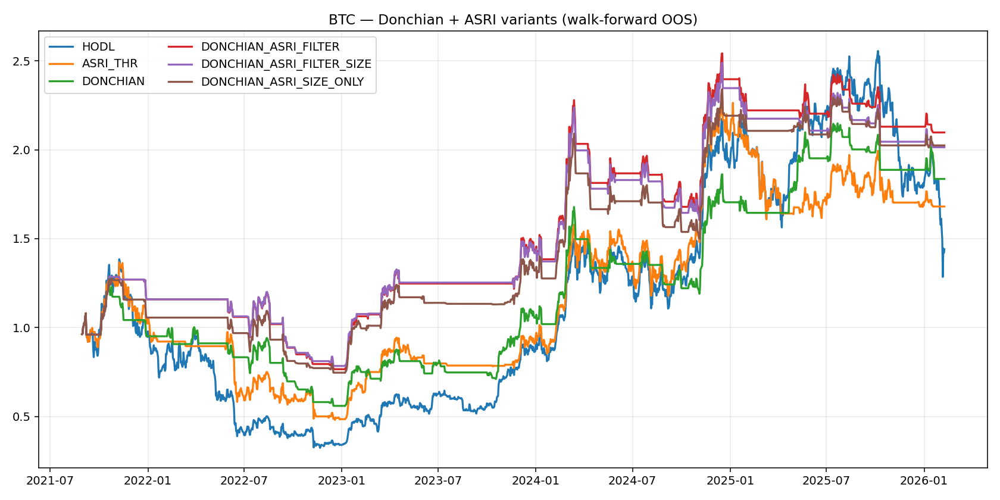
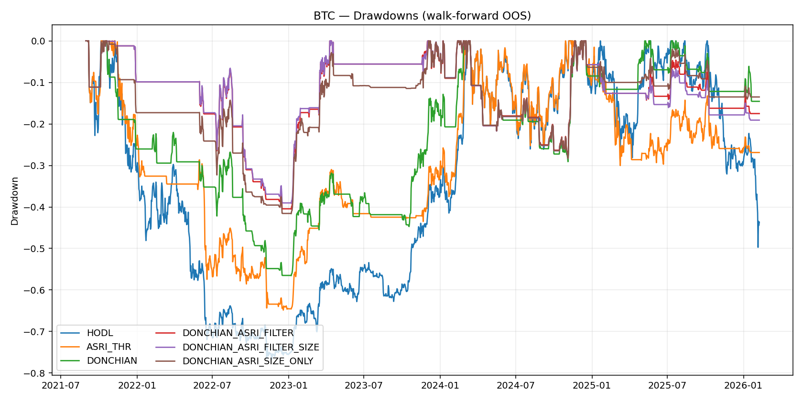

# BTC Donchian + ASRI — Walk-forward strategy comparison

**As-of (data end):** 2026-02-08

## Setup

- **BTC universe:** `CRYPTO:BTCUSD` (close-to-close returns)
- **Data period:** 2019-03-04 to 2026-02-08
- **Donchian rules:** entry `20d` breakout over prior high; exit `10d` break below prior low
- **ASRI signal:** rolling ECDF mid-rank (`AsriConfig.norm_rolling_method = 'ecdf_midrank'`)
- **Transaction costs:** 10.0 bps per 1.0 turnover
- **Walk-forward:** train/val/test/step = 730/180/90/90 days
- **Execution:** weights decided at close \(t\), applied to return \(t+1\)
- **OOS period:** 2021-08-30 to 2026-02-08

## Performance (walk-forward OOS)

| strategy                  | total_return   |   cagr |    vol |   sharpe |   max_dd |   folds |
|:--------------------------|:---------------|-------:|-------:|---------:|---------:|--------:|
| DONCHIAN_ASRI_FILTER      | 109.73%        | 0.1811 | 0.2774 |   0.7384 |  -0.4053 |      19 |
| DONCHIAN_ASRI_FILTER_SIZE | 101.41%        | 0.1704 | 0.2732 |   0.7122 |  -0.3911 |      19 |
| DONCHIAN_ASRI_SIZE_ONLY   | 102.44%        | 0.1718 | 0.2769 |   0.7105 |  -0.4164 |      19 |
| DONCHIAN                  | 83.58%         | 0.1463 | 0.3171 |   0.5886 |  -0.5655 |      19 |
| ASRI_THR                  | 68.08%         | 0.1238 | 0.4342 |   0.4865 |  -0.6483 |      19 |
| HODL                      | 43.98%         | 0.0854 | 0.5348 |   0.421  |  -0.7667 |      19 |

## Equity curves

## Drawdowns

## Hyperparameters selected (top counts)

### HODL

|    |   count |
|:---|--------:|
| {} |      19 |

### ASRI_THR

|                 |   count |
|:----------------|--------:|
| {'q_thr': 0.6}  |       7 |
| {'q_thr': 0.7}  |       5 |
| {'q_thr': 0.95} |       5 |
| {'q_thr': 0.8}  |       1 |
| {'q_thr': 0.9}  |       1 |

### DONCHIAN

|    |   count |
|:---|--------:|
| {} |      19 |

### DONCHIAN_ASRI_FILTER

|                 |   count |
|:----------------|--------:|
| {'q_thr': 0.7}  |       8 |
| {'q_thr': 0.6}  |       4 |
| {'q_thr': 0.95} |       4 |
| {'q_thr': 0.8}  |       2 |
| {'q_thr': 0.9}  |       1 |

### DONCHIAN_ASRI_FILTER_SIZE

|                                                |   count |
|:-----------------------------------------------|--------:|
| {'q_thr': 0.7, 'q_center': 0.9, 'slope': 0.3}  |       6 |
| {'q_thr': 0.6, 'q_center': 0.9, 'slope': 0.3}  |       3 |
| {'q_thr': 0.95, 'q_center': 0.9, 'slope': 0.3} |       2 |
| {'q_thr': 0.9, 'q_center': 0.9, 'slope': 0.3}  |       1 |
| {'q_thr': 0.8, 'q_center': 0.8, 'slope': 0.3}  |       1 |
| {'q_thr': 0.6, 'q_center': 0.6, 'slope': 0.05} |       1 |
| {'q_thr': 0.7, 'q_center': 0.6, 'slope': 0.05} |       1 |
| {'q_thr': 0.95, 'q_center': 0.9, 'slope': 0.2} |       1 |

### DONCHIAN_ASRI_SIZE_ONLY

|                                  |   count |
|:---------------------------------|--------:|
| {'q_center': 0.7, 'slope': 0.3}  |       7 |
| {'q_center': 0.6, 'slope': 0.3}  |       5 |
| {'q_center': 0.9, 'slope': 0.3}  |       2 |
| {'q_center': 0.8, 'slope': 0.3}  |       2 |
| {'q_center': 0.9, 'slope': 0.05} |       2 |
| {'q_center': 0.9, 'slope': 0.1}  |       1 |

