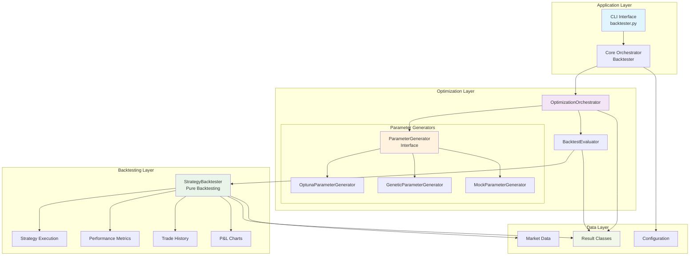
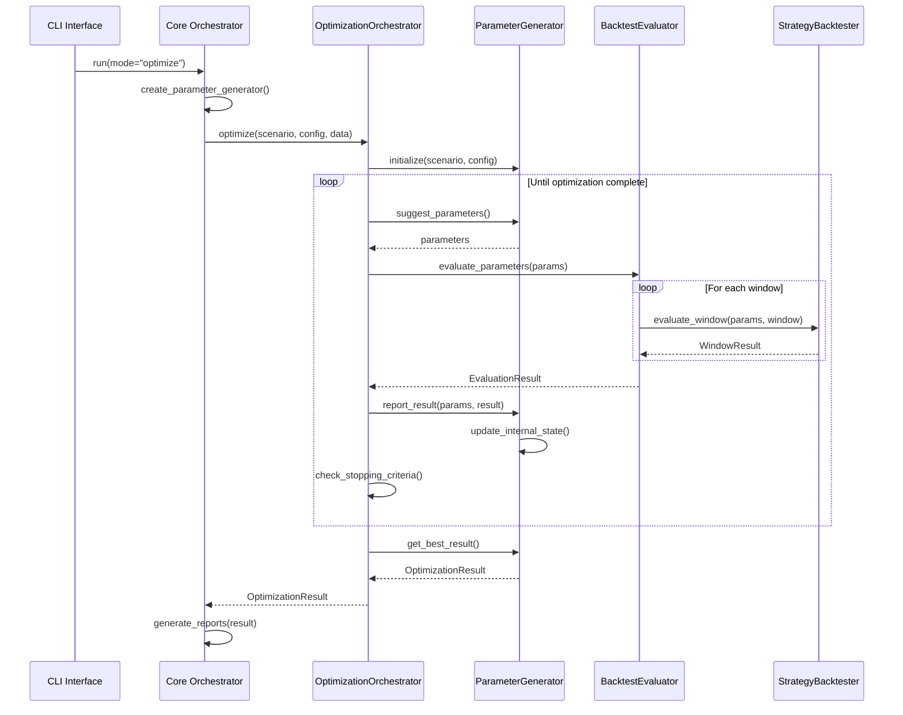
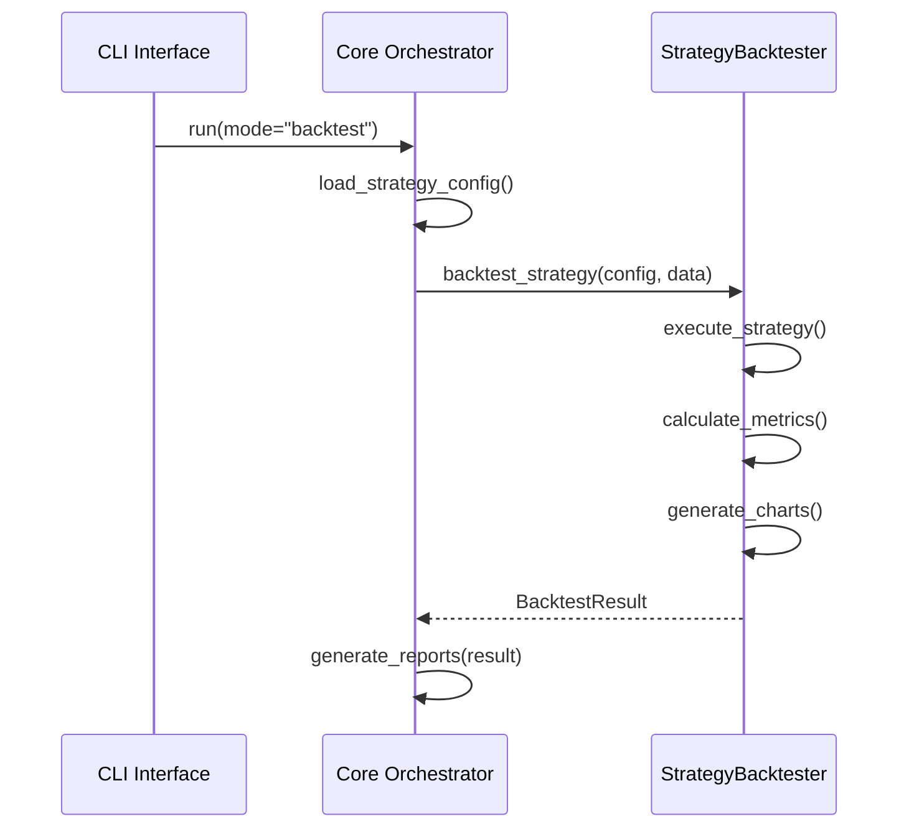
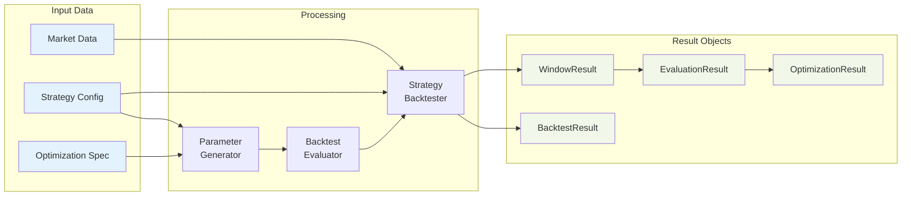

# Portfolio Backtester Architecture Documentation

## Overview

The Portfolio Backtester has been refactored to follow SOLID principles with complete separation of concerns between backtesting, optimization orchestration, and parameter generation. This document provides comprehensive architecture documentation for developers and maintainers.

## Architecture Principles

### 1. Separation of Concerns
- **Backtesting Layer**: Pure strategy execution and performance calculation
- **Optimization Layer**: Parameter generation and optimization orchestration  
- **Application Layer**: CLI interface and core coordination

### 2. Dependency Injection
- Components receive dependencies through constructor injection
- Enables easy testing with mock objects
- Supports runtime configuration of optimization backends

### 3. Interface Segregation
- Small, focused interfaces for each component type
- Parameter generators implement a common interface
- Clear contracts between layers

### 4. Open/Closed Principle
- System is open for extension (new optimizers) but closed for modification
- Factory pattern enables adding new backends without changing existing code

## Component Architecture



## Component Responsibilities

### StrategyBacktester (Pure Backtesting Engine)
**Location**: `src/portfolio_backtester/core.py`

**Responsibilities**:
- Execute trading strategies with given parameters
- Calculate performance metrics and generate trade history
- Evaluate individual walk-forward windows
- Generate P&L charts and performance statistics

**Key Characteristics**:
- No optimization-related imports or dependencies
- Stateless design for thread safety
- Pure functions with clear inputs and outputs
- Complete independence from parameter generation logic

### OptimizationOrchestrator
**Location**: `src/portfolio_backtester/optimization/orchestrator.py`

**Responsibilities**:
- Coordinate optimization process between parameter generators and evaluators
- Manage optimization lifecycle and progress tracking
- Handle timeout and early stopping logic
- Aggregate and return final optimization results

**Key Characteristics**:
- Dependency injection for all components
- Backend-agnostic optimization coordination
- Unified progress tracking across all optimizers
- Clean separation from both backtesting and parameter generation

### ParameterGenerator Interface
**Location**: `src/portfolio_backtester/optimization/parameter_generator.py`

**Responsibilities**:
- Define contract for parameter generation strategies
- Provide lifecycle management methods
- Ensure consistent behavior across different optimization backends

**Implementations**:
- `OptunaParameterGenerator`: Bayesian optimization with TPE sampling
- `GeneticParameterGenerator`: Genetic algorithm optimization with PyGAD
- `MockParameterGenerator`: Testing and development support

### BacktestEvaluator
**Location**: `src/portfolio_backtester/optimization/evaluator.py`

**Responsibilities**:
- Perform walk-forward analysis for parameter sets
- Aggregate window results into final evaluation metrics
- Handle multi-objective evaluation
- Provide consistent evaluation interface for all optimizers

## Optimization Workflow



## Backtest-Only Workflow



## Data Flow Architecture



## Design Decisions

### 1. Why Separate StrategyBacktester?
- **Single Responsibility**: Backtesting logic should only handle strategy execution
- **Testability**: Pure backtester can be tested in complete isolation
- **Reusability**: Same backtester works for both optimization and standalone backtesting
- **Performance**: No optimization overhead when doing simple backtests

### 2. Why Use Dependency Injection?
- **Flexibility**: Easy to swap different parameter generators
- **Testing**: Mock objects can be injected for unit testing
- **Configuration**: Runtime selection of optimization backends
- **Decoupling**: Components don't need to know about concrete implementations

### 3. Why Abstract Parameter Generator Interface?
- **Extensibility**: New optimizers can be added without changing existing code
- **Consistency**: All optimizers follow the same lifecycle and methods
- **Polymorphism**: Orchestrator works identically with any parameter generator
- **Maintainability**: Changes to one optimizer don't affect others

### 4. Why Factory Pattern for Parameter Generators?
- **Centralized Creation**: Single point for instantiating optimizers
- **Error Handling**: Consistent error messages for unknown optimizer types
- **Configuration**: Handles random state and other initialization parameters
- **Extensibility**: Easy to add new optimizers by updating factory

## Troubleshooting Guide

### Common Issues

#### 1. Import Errors
**Symptom**: `ModuleNotFoundError` when importing optimization components

**Causes**:
- Missing optional dependencies (optuna, pygad)
- Incorrect Python path configuration
- Virtual environment not activated

**Solutions**:
```bash
# Install optional dependencies
pip install optuna pygad

# Verify installation
python -c "import optuna; import pygad; print('Dependencies OK')"

# Check Python path
python -c "import sys; print(sys.path)"
```

#### 2. Parameter Generator Initialization Failures
**Symptom**: Errors during `create_parameter_generator()` call

**Causes**:
- Invalid optimizer type string
- Malformed optimization specification
- Missing required configuration parameters

**Solutions**:
```python
# Verify optimizer type
valid_types = ["optuna", "genetic", "mock"]
assert optimizer_type in valid_types

# Check optimization specification format
required_keys = ["parameters", "objective", "direction"]
assert all(key in optimization_spec for key in required_keys)
```

#### 3. Evaluation Failures
**Symptom**: Errors during parameter evaluation

**Causes**:
- Invalid parameter values
- Data loading issues
- Strategy configuration problems

**Solutions**:
```python
# Validate parameters against bounds
for param, value in parameters.items():
    spec = optimization_spec["parameters"][param]
    assert spec["low"] <= value <= spec["high"]

# Check data availability
assert not monthly_data.empty
assert not daily_data.empty
```

#### 4. Memory Issues During Long Optimizations
**Symptom**: Out of memory errors or performance degradation

**Causes**:
- Large parameter spaces
- Memory leaks in result accumulation
- Inefficient data structures

**Solutions**:
```python
# Use generators for large parameter spaces
# Clear intermediate results
# Monitor memory usage with memory_profiler
```

### Debugging Tips

#### 1. Enable Debug Logging
```python
import logging
logging.basicConfig(level=logging.DEBUG)

# Component-specific loggers
backtester_logger = logging.getLogger('portfolio_backtester.backtesting')
optimization_logger = logging.getLogger('portfolio_backtester.optimization')
```

#### 2. Use Mock Components for Testing
```python
from portfolio_backtester.optimization.generators.mock_generator import MockParameterGenerator

# Replace real optimizer with mock for debugging
generator = MockParameterGenerator(parameters=test_parameters)
```

#### 3. Validate Component Isolation
```python
# Test backtester isolation
from portfolio_backtester.feature_flags import FeatureFlags

with FeatureFlags.disable_all_optimizers():
    backtester = StrategyBacktester(config, data_source)
    result = backtester.backtest_strategy(scenario, monthly, daily, returns)
```

#### 4. Check Result Object Structure
```python
# Verify result objects have expected structure
assert hasattr(result, 'returns')
assert hasattr(result, 'metrics')
assert hasattr(result, 'trade_history')
```

### Performance Optimization

#### 1. Optimization Speed
- Use appropriate sample sizes for walk-forward windows
- Consider parallel evaluation for independent parameters
- Cache expensive calculations where possible

#### 2. Memory Usage
- Clear intermediate results after aggregation
- Use generators for large parameter spaces
- Monitor memory usage during long optimizations

#### 3. I/O Optimization
- Batch data loading operations
- Use efficient data formats (parquet vs CSV)
- Implement smart caching strategies

## Migration from Legacy Architecture

### Key Changes
1. **Backtester Class**: Now delegates to new architecture components
2. **Optimization Methods**: Moved from Backtester to OptimizationOrchestrator
3. **Parameter Generation**: Abstracted behind ParameterGenerator interface
4. **Result Objects**: Structured data classes replace ad-hoc dictionaries

### Backward Compatibility
- Legacy methods still work but show deprecation warnings
- Feature flags allow gradual migration
- Adapter layer maintains existing API surface

### Migration Timeline
1. **Phase 1**: New architecture available alongside legacy
2. **Phase 2**: Deprecation warnings for legacy methods
3. **Phase 3**: Legacy methods removed (future release)

This architecture provides a solid foundation for maintainable, extensible, and testable optimization workflows while preserving all existing functionality.