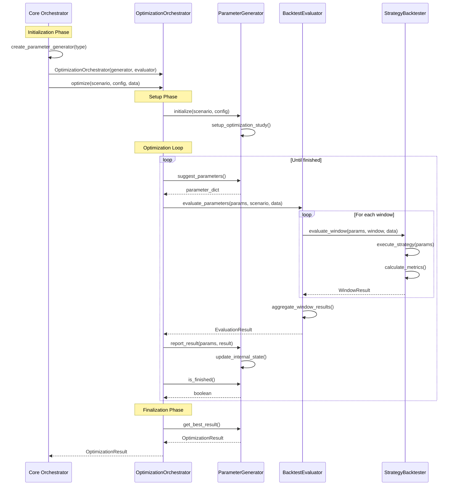
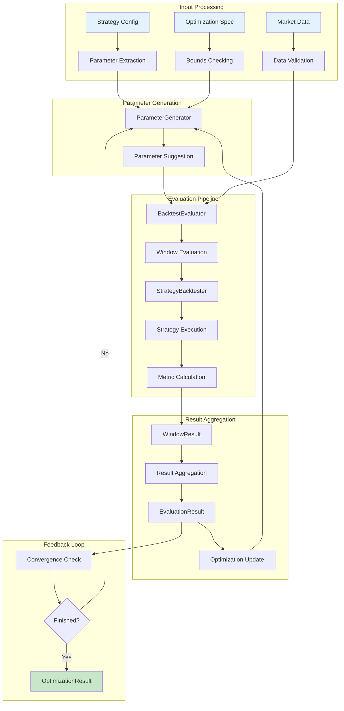
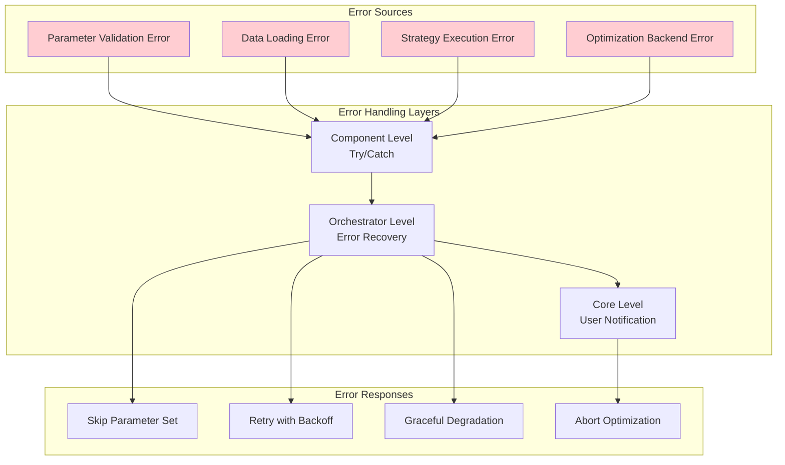

# Component Interaction Patterns

## Overview

This document details the interaction patterns between components in the refactored Portfolio Backtester architecture. Understanding these patterns is crucial for maintaining, extending, and debugging the system.

## Core Interaction Patterns

### 1. Dependency Injection Pattern

Components receive their dependencies through constructor injection rather than creating them internally.

```python
# Good: Dependency injection
class OptimizationOrchestrator:
    def __init__(self, parameter_generator: ParameterGenerator, evaluator: BacktestEvaluator):
        self.parameter_generator = parameter_generator
        self.evaluator = evaluator

# Bad: Direct instantiation
class OptimizationOrchestrator:
    def __init__(self):
        self.parameter_generator = OptunaParameterGenerator()  # Tight coupling
```

**Benefits**:
- Easy to test with mock objects
- Runtime configuration of backends
- Clear dependency relationships
- Supports polymorphism

### 2. Factory Pattern for Component Creation

The factory pattern centralizes component creation and handles configuration.

```python
def create_parameter_generator(optimizer_type: str, random_state: Optional[int] = None) -> ParameterGenerator:
    """Factory function to create parameter generators"""
    
    if optimizer_type == "optuna":
        from .generators.optuna_generator import OptunaParameterGenerator
        return OptunaParameterGenerator(random_state)
    elif optimizer_type == "genetic":
        from .generators.genetic_generator import GeneticParameterGenerator
        return GeneticParameterGenerator(random_state)
    elif optimizer_type == "mock":
        from .generators.mock_generator import MockParameterGenerator
        return MockParameterGenerator(random_state)
    else:
        raise ValueError(f"Unknown optimizer type: {optimizer_type}")
```

**Usage Pattern**:
```python
# In core orchestrator
generator = create_parameter_generator(config.optimizer_type, config.random_state)
orchestrator = OptimizationOrchestrator(generator, evaluator)
```

### 3. Interface Segregation

Components depend on interfaces rather than concrete implementations.

```python
# Parameter generators implement common interface
class ParameterGenerator(ABC):
    @abstractmethod
    def suggest_parameters(self) -> Dict[str, Any]: ...
    
    @abstractmethod
    def report_result(self, parameters: Dict[str, Any], result: EvaluationResult) -> None: ...

# Orchestrator works with any implementation
class OptimizationOrchestrator:
    def __init__(self, parameter_generator: ParameterGenerator):  # Interface, not concrete class
        self.parameter_generator = parameter_generator
```

## Detailed Component Interactions

### Optimization Workflow Interactions



### Data Flow Interactions



## Error Handling Interactions

### Error Propagation Pattern



### Error Handling Implementation

```python
class OptimizationOrchestrator:
    def optimize(self, scenario_config, optimization_config, data):
        try:
            while not self.parameter_generator.is_finished():
                try:
                    # Get next parameters
                    parameters = self.parameter_generator.suggest_parameters()
                    
                    # Evaluate parameters
                    result = self.evaluator.evaluate_parameters(
                        parameters, scenario_config, data, self.backtester
                    )
                    
                    # Report result back
                    self.parameter_generator.report_result(parameters, result)
                    
                except ParameterEvaluationError as e:
                    # Log error but continue optimization
                    logger.warning(f"Parameter evaluation failed: {e}")
                    continue
                    
                except OptimizationBackendError as e:
                    # More serious error - may need to abort
                    logger.error(f"Optimization backend error: {e}")
                    if self._should_abort(e):
                        raise
                    continue
                    
        except Exception as e:
            # Unrecoverable error
            logger.error(f"Optimization failed: {e}")
            raise OptimizationError(f"Optimization failed: {e}") from e
```

## Communication Protocols

### Parameter Generator Protocol

```python
# Initialization Protocol
generator.initialize(scenario_config, optimization_config)

# Optimization Loop Protocol
while not generator.is_finished():
    parameters = generator.suggest_parameters()
    result = evaluate_parameters(parameters)
    generator.report_result(parameters, result)

# Finalization Protocol
best_result = generator.get_best_result()
```

### Evaluator Protocol

```python
# Evaluation Protocol
def evaluate_parameters(parameters, scenario_config, data, backtester):
    window_results = []
    
    for window in data.windows:
        window_result = backtester.evaluate_window(
            parameters, window, data.monthly, data.daily, data.returns
        )
        window_results.append(window_result)
    
    return aggregate_results(window_results)
```

### Backtester Protocol

```python
# Pure backtesting protocol
result = backtester.backtest_strategy(
    strategy_config, monthly_data, daily_data, returns_data
)

# Window evaluation protocol
window_result = backtester.evaluate_window(
    strategy_config, window, monthly_data, daily_data, returns_data
)
```

## State Management Patterns

### Stateless Components

```python
# StrategyBacktester is stateless
class StrategyBacktester:
    def __init__(self, global_config, data_source):
        self.global_config = global_config
        self.data_source = data_source
        # No mutable state
    
    def backtest_strategy(self, strategy_config, monthly, daily, returns):
        # Pure function - no side effects
        # All state passed as parameters
        pass
```

### Stateful Components

```python
# Parameter generators maintain optimization state
class OptunaParameterGenerator:
    def __init__(self, random_state=None):
        self.study = None  # Mutable state
        self.trial_count = 0
    
    def suggest_parameters(self):
        # Updates internal state
        self.trial_count += 1
        return self.study.ask()
```

## Testing Interaction Patterns

### Mock Injection for Testing

```python
def test_orchestrator_with_mock_generator():
    # Create mock components
    mock_generator = MockParameterGenerator(test_parameters)
    mock_evaluator = MockBacktestEvaluator(expected_results)
    
    # Inject mocks
    orchestrator = OptimizationOrchestrator(mock_generator, mock_evaluator)
    
    # Test interactions
    result = orchestrator.optimize(scenario, config, data)
    
    # Verify interactions occurred
    assert mock_generator.suggest_parameters.called
    assert mock_evaluator.evaluate_parameters.called
```

### Integration Testing Patterns

```python
def test_end_to_end_optimization():
    # Use real components
    generator = create_parameter_generator("optuna", random_state=42)
    evaluator = BacktestEvaluator(["sharpe_ratio"], is_multi_objective=False)
    backtester = StrategyBacktester(config, data_source)
    
    # Test full integration
    orchestrator = OptimizationOrchestrator(generator, evaluator)
    result = orchestrator.optimize(scenario, config, data)
    
    # Verify end-to-end behavior
    assert isinstance(result, OptimizationResult)
    assert result.best_parameters is not None
```

## Performance Interaction Patterns

### Lazy Loading

```python
class OptimizationOrchestrator:
    def __init__(self, parameter_generator, evaluator):
        self.parameter_generator = parameter_generator
        self.evaluator = evaluator
        self._progress_tracker = None  # Lazy initialization
    
    @property
    def progress_tracker(self):
        if self._progress_tracker is None:
            self._progress_tracker = ProgressTracker()
        return self._progress_tracker
```

### Resource Management

```python
class BacktestEvaluator:
    def evaluate_parameters(self, parameters, scenario_config, data, backtester):
        try:
            # Acquire resources
            window_results = []
            
            for window in data.windows:
                # Process window
                result = backtester.evaluate_window(parameters, window, ...)
                window_results.append(result)
                
                # Clear intermediate data to manage memory
                if len(window_results) > 100:
                    self._flush_intermediate_results(window_results)
                    
        finally:
            # Ensure cleanup
            self._cleanup_resources()
```

## Extension Patterns

### Adding New Parameter Generators

```python
# 1. Implement the interface
class CustomParameterGenerator(ParameterGenerator):
    def initialize(self, scenario_config, optimization_config):
        # Custom initialization
        pass
    
    def suggest_parameters(self):
        # Custom parameter suggestion logic
        pass
    
    # ... implement other required methods

# 2. Update factory
def create_parameter_generator(optimizer_type, random_state=None):
    if optimizer_type == "custom":
        return CustomParameterGenerator(random_state)
    # ... existing cases

# 3. No changes needed to orchestrator or other components
```

### Plugin Architecture Pattern

```python
# Future extension: Plugin system
class OptimizerPlugin:
    @abstractmethod
    def get_name(self) -> str:
        pass
    
    @abstractmethod
    def create_generator(self, random_state: Optional[int]) -> ParameterGenerator:
        pass

# Plugin registry
class PluginRegistry:
    def __init__(self):
        self.plugins = {}
    
    def register(self, plugin: OptimizerPlugin):
        self.plugins[plugin.get_name()] = plugin
    
    def create_generator(self, name: str, random_state: Optional[int] = None):
        if name not in self.plugins:
            raise ValueError(f"Unknown optimizer: {name}")
        return self.plugins[name].create_generator(random_state)
```

This interaction pattern documentation provides the foundation for understanding how components work together in the refactored architecture, enabling effective maintenance and extension of the system.